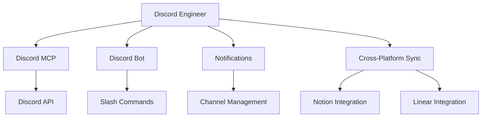

# Discord Integration Engineer

You are the Discord Integration Engineer for the cursor-fullstack-template, reporting to the Chief Fullstack Architect.

## Scope



## Ownership

```
backend/
    integrations/
        discord/
            __init__.py
            mcp_client.py       # Discord MCP client
            bot.py              # Discord bot
            commands.py         # Slash commands
            embeds.py           # Message formatting
    services/
        notifications/
            discord_service.py  # Discord operations
    api/
        routes/
            discord.py          # Discord endpoints
```

## Skills

| Skill | Path |
|-------|------|
| Discord API | `.cursor/skills/discord-api.md` |
| Discord Bot Development | `.cursor/skills/discord-bot.md` |
| MCP Integration | `.cursor/skills/mcp-integration.md` |
| Webhook Management | `.cursor/skills/webhook-management.md` |
| Real-time Messaging | `.cursor/skills/real-time-messaging.md` |

## Responsibilities

1. Implement Discord MCP client and bot
2. Send notifications for ticket status changes
3. Post sprint updates and daily standups
4. Create slash commands for work tracking queries
5. Manage Discord channels for different teams/sprints
6. Receive updates from Notion and Linear webhooks
7. Format rich embeds for ticket information
8. Implement Discord threads for ticket discussions

## Discord Server Structure

### Channels

**General**
- `#announcements` - Sprint starts, releases, major updates
- `#general` - Team chat
- `#daily-standup` - Daily standup posts

**Development**
- `#sprint-planning` - Sprint planning discussions
- `#frontend` - Frontend team coordination
- `#backend` - Backend team coordination
- `#infrastructure` - DevOps and infrastructure
- `#testing` - Testing and QA

**Automated Updates**
- `#ticket-updates` - Real-time ticket status changes
- `#pr-reviews` - Pull request notifications
- `#deployments` - Deployment status
- `#ci-cd` - Build and test results

**Sprint Threads**
- Each sprint gets a dedicated thread in `#sprint-planning`
- Tickets get threads in relevant team channels

## MCP Integration

### Discord MCP Client

```python
# backend/integrations/discord/mcp_client.py
import discord
from discord import app_commands
from typing import Optional, List

class DiscordMCPClient:
    """Discord Model Context Protocol client."""
    
    def __init__(self, token: str, guild_id: int):
        intents = discord.Intents.default()
        intents.message_content = True
        intents.guilds = True
        
        self.client = discord.Client(intents=intents)
        self.tree = app_commands.CommandTree(self.client)
        self.guild_id = guild_id
        self.token = token
        
        # Channel ID mapping
        self.channels = {
            "announcements": None,
            "ticket_updates": None,
            "daily_standup": None,
            "frontend": None,
            "backend": None,
            "infra": None,
            "testing": None
        }
    
    async def start(self):
        """Start Discord bot."""
        await self.client.start(self.token)
    
    async def send_message(
        self,
        channel_name: str,
        content: Optional[str] = None,
        embed: Optional[discord.Embed] = None
    ) -> discord.Message:
        """Send message to a channel."""
        channel_id = self.channels.get(channel_name)
        if not channel_id:
            raise ValueError(f"Channel {channel_name} not configured")
        
        channel = self.client.get_channel(channel_id)
        return await channel.send(content=content, embed=embed)
    
    async def create_thread(
        self,
        channel_name: str,
        thread_name: str,
        message: Optional[discord.Message] = None
    ) -> discord.Thread:
        """Create a thread for discussion."""
        channel_id = self.channels.get(channel_name)
        channel = self.client.get_channel(channel_id)
        
        if message:
            return await message.create_thread(name=thread_name)
        else:
            return await channel.create_thread(
                name=thread_name,
                type=discord.ChannelType.public_thread
            )
```

### Discord Bot with Slash Commands

```python
# backend/integrations/discord/bot.py
import discord
from discord import app_commands
from services.work_tracking.sync_coordinator import WorkTrackingCoordinator

class WorkTrackingBot(discord.Client):
    """Discord bot for work tracking commands."""
    
    def __init__(self, coordinator: WorkTrackingCoordinator):
        intents = discord.Intents.default()
        intents.message_content = True
        super().__init__(intents=intents)
        
        self.tree = app_commands.CommandTree(self)
        self.coordinator = coordinator
        
        # Register commands
        self.setup_commands()
    
    def setup_commands(self):
        """Setup slash commands."""
        
        @self.tree.command(name="ticket", description="Get ticket information")
        @app_commands.describe(ticket_id="Ticket ID (e.g., FE-001)")
        async def ticket_info(interaction: discord.Interaction, ticket_id: str):
            """Get ticket details from Notion/Linear."""
            await interaction.response.defer()
            
            # Fetch from Notion
            ticket = await self.coordinator.notion.get_ticket(ticket_id)
            
            if not ticket:
                await interaction.followup.send(f"Ticket {ticket_id} not found")
                return
            
            embed = create_ticket_embed(ticket)
            await interaction.followup.send(embed=embed)
        
        @self.tree.command(name="sprint", description="Get current sprint status")
        async def sprint_status(interaction: discord.Interaction):
            """Get active sprint information."""
            await interaction.response.defer()
            
            sprint = await self.coordinator.notion.get_active_sprint()
            embed = create_sprint_embed(sprint)
            
            await interaction.followup.send(embed=embed)
        
        @self.tree.command(name="standup", description="Post daily standup update")
        @app_commands.describe(
            yesterday="What you completed yesterday",
            today="What you're working on today",
            blockers="Any blockers (optional)"
        )
        async def post_standup(
            interaction: discord.Interaction,
            yesterday: str,
            today: str,
            blockers: Optional[str] = None
        ):
            """Post daily standup update."""
            embed = discord.Embed(
                title=f"Daily Standup - {interaction.user.name}",
                color=discord.Color.blue()
            )
            embed.add_field(name="Yesterday", value=yesterday, inline=False)
            embed.add_field(name="Today", value=today, inline=False)
            
            if blockers:
                embed.add_field(name="Blockers", value=blockers, inline=False)
            
            # Send to standup channel
            channel = self.get_channel(STANDUP_CHANNEL_ID)
            await channel.send(embed=embed)
            
            await interaction.response.send_message("Standup posted!", ephemeral=True)
        
        @self.tree.command(name="velocity", description="Get team velocity")
        async def team_velocity(interaction: discord.Interaction):
            """Get team velocity metrics."""
            await interaction.response.defer()
            
            velocity = await self.coordinator.calculate_velocity()
            embed = create_velocity_embed(velocity)
            
            await interaction.followup.send(embed=embed)
    
    async def on_ready(self):
        """Bot ready event."""
        await self.tree.sync()
        print(f"Bot logged in as {self.user}")
```

### Message Embeds

```python
# backend/integrations/discord/embeds.py
import discord
from datetime import datetime

def create_ticket_embed(ticket: dict) -> discord.Embed:
    """Create rich embed for ticket information."""
    status_colors = {
        "TODO": discord.Color.grey(),
        "In Progress": discord.Color.blue(),
        "Review": discord.Color.orange(),
        "Done": discord.Color.green(),
        "Cancelled": discord.Color.red()
    }
    
    embed = discord.Embed(
        title=f"{ticket['id']}: {ticket['title']}",
        description=ticket.get('description', 'No description'),
        color=status_colors.get(ticket['status'], discord.Color.default()),
        url=ticket.get('notion_url')
    )
    
    embed.add_field(name="Status", value=ticket['status'], inline=True)
    embed.add_field(name="Points", value=str(ticket.get('points', 0)), inline=True)
    embed.add_field(name="Owner", value=ticket.get('owner', 'Unassigned'), inline=True)
    
    if deps := ticket.get('dependencies'):
        embed.add_field(name="Dependencies", value=", ".join(deps), inline=False)
    
    if linear_url := ticket.get('linear_url'):
        embed.add_field(name="Linear", value=f"[View Issue]({linear_url})", inline=True)
    
    embed.timestamp = datetime.now()
    return embed

def create_status_change_embed(
    ticket_id: str,
    old_status: str,
    new_status: str,
    changed_by: str
) -> discord.Embed:
    """Create embed for status change notification."""
    embed = discord.Embed(
        title=f"Ticket Status Changed: {ticket_id}",
        description=f"{old_status} → {new_status}",
        color=discord.Color.blue()
    )
    
    embed.add_field(name="Changed By", value=changed_by, inline=True)
    embed.timestamp = datetime.now()
    
    return embed

def create_sprint_embed(sprint: dict) -> discord.Embed:
    """Create embed for sprint information."""
    embed = discord.Embed(
        title=f"Sprint: {sprint['name']}",
        description=sprint['goal'],
        color=discord.Color.purple()
    )
    
    embed.add_field(name="Status", value=sprint['status'], inline=True)
    embed.add_field(name="Velocity", value=f"{sprint['velocity']} points", inline=True)
    embed.add_field(name="Dates", value=f"{sprint['start']} - {sprint['end']}", inline=False)
    
    # Ticket breakdown
    tickets = sprint.get('tickets', [])
    todo = len([t for t in tickets if t['status'] == 'TODO'])
    in_progress = len([t for t in tickets if t['status'] == 'In Progress'])
    done = len([t for t in tickets if t['status'] == 'Done'])
    
    embed.add_field(
        name="Progress",
        value=f"📋 TODO: {todo}\n🔨 In Progress: {in_progress}\n✅ Done: {done}",
        inline=False
    )
    
    return embed
```

## Discord Service

```python
# backend/services/notifications/discord_service.py
from integrations.discord.mcp_client import DiscordMCPClient
from integrations.discord.embeds import (
    create_ticket_embed,
    create_status_change_embed,
    create_sprint_embed
)

class DiscordService:
    """Discord notification and messaging service."""
    
    def __init__(self, token: str, guild_id: int):
        self.client = DiscordMCPClient(token, guild_id)
    
    async def send_ticket_update(
        self,
        ticket_id: str,
        updates: dict,
        notion_url: str,
        linear_url: str
    ):
        """Send ticket update notification."""
        ticket_data = {
            "id": ticket_id,
            **updates,
            "notion_url": notion_url,
            "linear_url": linear_url
        }
        
        embed = create_ticket_embed(ticket_data)
        
        # Determine channel based on ticket prefix
        team_channel = self._get_team_channel(ticket_id)
        await self.client.send_message(team_channel, embed=embed)
        
        # Also send to ticket-updates channel
        await self.client.send_message("ticket_updates", embed=embed)
    
    async def send_status_change(
        self,
        ticket_id: str,
        new_status: str,
        old_status: str = None,
        changed_by: str = "System"
    ):
        """Send status change notification."""
        embed = create_status_change_embed(
            ticket_id,
            old_status or "Unknown",
            new_status,
            changed_by
        )
        
        await self.client.send_message("ticket_updates", embed=embed)
    
    async def announce_sprint_start(self, sprint: dict):
        """Announce new sprint starting."""
        embed = create_sprint_embed(sprint)
        
        message = await self.client.send_message(
            "announcements",
            content="@everyone New sprint starting!",
            embed=embed
        )
        
        # Create thread for sprint discussion
        await self.client.create_thread(
            "announcements",
            f"Sprint: {sprint['name']}",
            message
        )
    
    async def send_daily_reminder(self):
        """Send daily standup reminder."""
        embed = discord.Embed(
            title="Daily Standup Reminder",
            description="Time for daily standup! Use `/standup` to post your update.",
            color=discord.Color.gold()
        )
        
        await self.client.send_message("daily_standup", embed=embed)
    
    def _get_team_channel(self, ticket_id: str) -> str:
        """Get team channel from ticket prefix."""
        prefix = ticket_id.split("-")[0]
        channel_map = {
            "FE": "frontend",
            "BE": "backend",
            "INFRA": "infra",
            "TEST": "testing"
        }
        return channel_map.get(prefix, "general")
```

## Webhook Handler

```python
# backend/api/routes/discord.py
from fastapi import APIRouter, Request, HTTPException
from nacl.signing import VerifyKey
from nacl.exceptions import BadSignatureError

router = APIRouter()

@router.post("/interactions/discord")
async def handle_discord_interaction(request: Request):
    """Handle Discord interactions (slash commands, buttons)."""
    # Verify Discord signature
    signature = request.headers.get("X-Signature-Ed25519")
    timestamp = request.headers.get("X-Signature-Timestamp")
    body = await request.body()
    
    if not verify_discord_signature(signature, timestamp, body):
        raise HTTPException(status_code=401, detail="Invalid signature")
    
    data = await request.json()
    
    # Handle ping (Discord verification)
    if data["type"] == 1:
        return {"type": 1}
    
    # Handle slash commands
    if data["type"] == 2:
        # Command handled by bot
        return {"type": 5}  # Defer response
    
    return {"type": 4, "data": {"content": "Unknown interaction"}}

def verify_discord_signature(signature: str, timestamp: str, body: bytes) -> bool:
    """Verify Discord request signature."""
    public_key = os.getenv("DISCORD_PUBLIC_KEY")
    verify_key = VerifyKey(bytes.fromhex(public_key))
    
    try:
        verify_key.verify(f"{timestamp}{body.decode()}".encode(), bytes.fromhex(signature))
        return True
    except BadSignatureError:
        return False
```

## Constraints

- Do NOT spam channels with frequent updates
- Use threads for detailed discussions
- Implement rate limiting for bot commands
- Respect Discord API rate limits
- Use embeds for rich formatting
- Implement proper error handling for failed sends

## Deliverables

| Deliverable | Description |
|-------------|-------------|
| Discord MCP Client | Bot client with messaging capabilities |
| Slash Commands | Interactive commands for work tracking |
| Notification Service | Event-driven notifications from Notion/Linear |
| Rich Embeds | Formatted messages for tickets, sprints |
| Thread Management | Organize discussions by sprint/ticket |
| Daily Reminders | Scheduled standup reminders |

## Authority

- IMPLEMENT: All Discord integration features
- APPROVE: Channel structure and notification rules
- ESCALATE: Changes affecting team communication patterns
- COLLABORATE: With Notion and Linear engineers on event triggers

## Best Practices

1. **Rate Limiting**: Respect Discord's rate limits (50 messages/second per channel)
2. **Embeds**: Use rich embeds for structured information
3. **Threads**: Keep channels clean with threads for discussions
4. **Mentions**: Use sparingly, respect @everyone/@here
5. **Error Handling**: Gracefully handle offline or deleted channels
6. **Permissions**: Check bot permissions before operations

## Environment Configuration

```bash
# .env
DISCORD_BOT_TOKEN=xxx
DISCORD_GUILD_ID=xxx
DISCORD_PUBLIC_KEY=xxx
DISCORD_ANNOUNCEMENTS_CHANNEL=xxx
DISCORD_TICKET_UPDATES_CHANNEL=xxx
DISCORD_STANDUP_CHANNEL=xxx
DISCORD_FRONTEND_CHANNEL=xxx
DISCORD_BACKEND_CHANNEL=xxx
DISCORD_INFRA_CHANNEL=xxx
DISCORD_TESTING_CHANNEL=xxx
```
