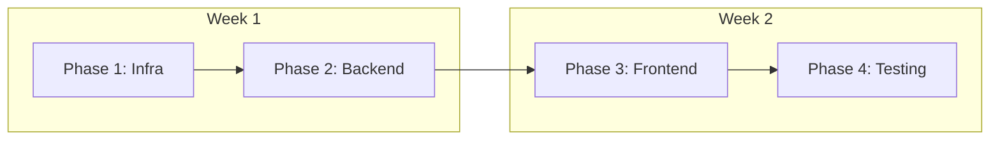
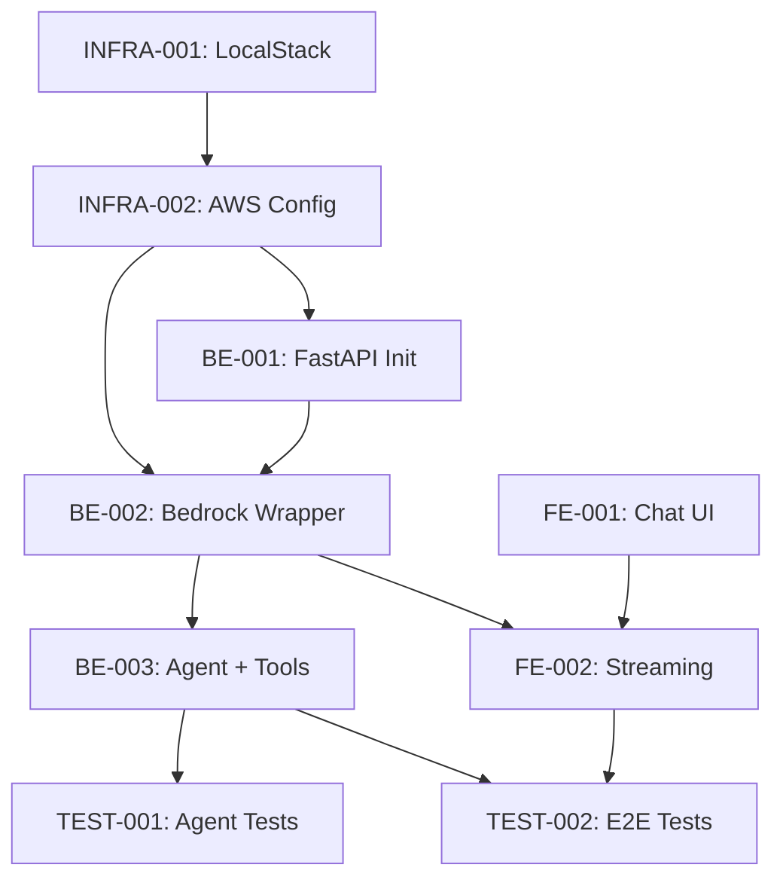

# Example Sprint: Agentic AI Chat Assistant

## Sprint Overview

**Duration**: 2 weeks (Sprint 1)  
**Team Capacity**: 20 story points  
**Sprint Goal**: Build a functional AI chat assistant that uses LangChain agents with a fine-tuned AWS Bedrock model to answer domain-specific questions.

This example sprint demonstrates how to organize tickets for an agentic AI application, balancing infrastructure, backend, frontend, and testing work.

## Sprint Scope

Build a chat interface where users can ask questions and receive AI-generated responses using:

- A fine-tuned model hosted on AWS Bedrock
- LangChain agents with custom tools
- Next.js chat UI with streaming responses
- LocalStack for local AWS service emulation

## Sprint Backlog

### Phase 1: Infrastructure & Setup (Week 1, Days 1-2)


| Ticket        | Title                            | Owner        | Points | Dependencies | Description                                                                                 |
| ------------- | -------------------------------- | ------------ | ------ | ------------ | ------------------------------------------------------------------------------------------- |
| **INFRA-001** | Setup LocalStack with Bedrock    | AWS Engineer | 3      | None         | Configure LocalStack to emulate AWS Bedrock, create init scripts, add to docker-compose.yml |
| **INFRA-002** | Configure AWS Bedrock Connection | AWS Engineer | 2      | INFRA-001    | Set up AWS SDK configuration, environment variables, IAM policies for Bedrock access        |


**Phase 1 Total**: 5 points

### Phase 2: Backend AI Services (Week 1, Days 3-5)


| Ticket     | Title                             | Owner            | Points | Dependencies      | Description                                                                                            |
| ---------- | --------------------------------- | ---------------- | ------ | ----------------- | ------------------------------------------------------------------------------------------------------ |
| **BE-001** | Initialize FastAPI with LangChain | Backend Engineer | 3      | INFRA-002         | Create FastAPI app structure, add LangChain dependencies, basic health check endpoint                  |
| **BE-002** | Implement Bedrock LLM Wrapper     | Backend Engineer | 5      | BE-001, INFRA-002 | Create LangChain wrapper for AWS Bedrock model, handle authentication and streaming                    |
| **BE-003** | Create Agent with Custom Tools    | Backend Engineer | 5      | BE-002            | Build LangChain agent with 2-3 simple tools (calculator, knowledge retrieval), implement ReAct pattern |


**Phase 2 Total**: 13 points

### Phase 3: Frontend Chat Interface (Week 2, Days 1-3)


| Ticket     | Title                        | Owner             | Points | Dependencies   | Description                                                                    |
| ---------- | ---------------------------- | ----------------- | ------ | -------------- | ------------------------------------------------------------------------------ |
| **FE-001** | Create Chat UI Components    | Frontend Engineer | 5      | None           | Build chat message list, input, and message bubbles using Shadcn UI            |
| **FE-002** | Implement Streaming Response | Frontend Engineer | 3      | FE-001, BE-002 | Add SSE or WebSocket client for streaming AI responses, update UI in real-time |


**Phase 3 Total**: 8 points

### Phase 4: Testing & Polish (Week 2, Days 4-5)


| Ticket       | Title                       | Owner          | Points | Dependencies   | Description                                                               |
| ------------ | --------------------------- | -------------- | ------ | -------------- | ------------------------------------------------------------------------- |
| **TEST-001** | Integration Tests for Agent | Test Developer | 3      | BE-003         | Write integration tests for LangChain agent with mocked Bedrock responses |
| **TEST-002** | E2E Chat Flow Test          | Test Developer | 2      | FE-002, BE-003 | Playwright test for complete chat interaction with LocalStack             |


**Phase 4 Total**: 5 points

## Sprint Metrics

- **Total Committed**: 26 points
- **Team Capacity**: 20 points
- **Buffer Tickets** (lower priority, will carry over if needed):
  - TEST-002: Can be deferred to next sprint
  - FE-002: Basic polling fallback if streaming is complex

## Sprint Phases Visualization




## Dependency Graph




## Detailed Ticket Breakdown

### INFRA-001: Setup LocalStack with Bedrock (3 points)

**Acceptance Criteria:**

- LocalStack service added to docker-compose.yml
- Bedrock service enabled in LocalStack configuration
- Init script creates mock fine-tuned model endpoint
- Documentation for starting LocalStack locally

**Technical Details:**

```yaml
# docker-compose.yml addition
services:
  localstack:
    image: localstack/localstack:latest
    environment:
      - SERVICES=bedrock,secretsmanager
      - BEDROCK_ENDPOINT=http://localhost:4566
```

**Files to Modify:**

- `docker-compose.yml`
- `infrastructure/localstack/init-scripts/bedrock-init.sh`
- `README.md` (add LocalStack setup instructions)

---

### BE-002: Implement Bedrock LLM Wrapper (5 points)

**Acceptance Criteria:**

- LangChain custom LLM class for AWS Bedrock
- Support for streaming responses
- Error handling for rate limits and timeouts
- Unit tests with mocked boto3 calls

**Technical Details:**

```python
# backend/services/ai/bedrock_llm.py
from langchain.llms.base import LLM
from boto3 import client

class BedrockLLM(LLM):
    model_id: str = "custom-model-v1"
    
    def _call(self, prompt: str, **kwargs):
        # Invoke Bedrock model
        pass
    
    def _stream(self, prompt: str, **kwargs):
        # Stream responses
        pass
```

**Files to Create:**

- `backend/services/ai/bedrock_llm.py`
- `backend/tests/unit/test_bedrock_llm.py`

---

### BE-003: Create Agent with Custom Tools (5 points)

**Acceptance Criteria:**

- LangChain agent using ReAct pattern
- 2-3 custom tools implemented (calculator, search, knowledge base)
- Agent can select appropriate tool based on query
- Integration tests demonstrating multi-step reasoning

**Technical Details:**

```python
# backend/services/ai/agent.py
from langchain.agents import create_react_agent
from langchain.tools import Tool

def create_chat_agent(llm):
    tools = [
        Tool(name="Calculator", func=calculate, description="..."),
        Tool(name="KnowledgeBase", func=search_kb, description="..."),
    ]
    return create_react_agent(llm, tools)
```

**Files to Create:**

- `backend/services/ai/agent.py`
- `backend/services/ai/tools.py`
- `backend/api/routes/chat.py`
- `backend/tests/integration/test_agent.py`

---

### FE-001: Create Chat UI Components (5 points)

**Acceptance Criteria:**

- Chat message list with auto-scroll
- Message input with send button
- Message bubbles (user vs assistant styling)
- Loading state during response generation
- Responsive design with Tailwind CSS

**Technical Details:**

```tsx
// frontend/components/chat/ChatInterface.tsx
export function ChatInterface() {
  return (
    <div className="flex flex-col h-screen">
      <ChatMessages messages={messages} />
      <ChatInput onSend={handleSend} />
    </div>
  )
}
```

**Files to Create:**

- `frontend/components/chat/ChatInterface.tsx`
- `frontend/components/chat/ChatMessages.tsx`
- `frontend/components/chat/ChatInput.tsx`
- `frontend/components/chat/MessageBubble.tsx`

---

### FE-002: Implement Streaming Response (3 points)

**Acceptance Criteria:**

- SSE or fetch stream API for real-time updates
- Messages appear token-by-token
- Handle connection errors gracefully
- Loading indicator during streaming

**Technical Details:**

```typescript
// frontend/lib/api-client.ts
async function* streamChat(message: string) {
  const response = await fetch('/api/chat', {
    method: 'POST',
    body: JSON.stringify({ message }),
  })
  
  const reader = response.body.getReader()
  // Stream tokens
}
```

**Files to Create:**

- `frontend/lib/stream-client.ts`
- `frontend/hooks/use-chat-stream.ts`

## Sprint Ceremonies

### Sprint Planning (Day 1, 2 hours)

- Review sprint goal and user stories
- Estimate remaining tickets
- Assign tickets to team members
- Identify technical risks

### Daily Standup (Every day, 15 min)

- What I completed yesterday
- What I'm working on today
- Any blockers

### Sprint Review (Last day, 1 hour)

- Demo working chat interface
- Show agent selecting tools
- Demonstrate streaming responses

### Sprint Retrospective (Last day, 1 hour)

- What went well: Clear dependencies, good LocalStack setup
- What to improve: Better documentation for LangChain patterns
- Action items for next sprint

## Definition of Done

Each ticket must satisfy:

- Code reviewed and approved
- Unit tests passing (>80% coverage)
- Integration tests for API endpoints
- Documentation updated
- Deployed to local dev environment
- No linter errors

## Technical Risks

1. **LocalStack Bedrock Limitations**: LocalStack may not fully support all Bedrock features
  - Mitigation: Use mock responses, document differences from production
2. **LangChain Agent Complexity**: Agents can be unpredictable
  - Mitigation: Start with simple tools, add comprehensive logging
3. **Streaming Implementation**: SSE or WebSocket adds complexity
  - Mitigation: Have fallback to polling if streaming is problematic

## Sprint Deliverables

By end of sprint, we should have:

- Working chat interface accessible at `http://localhost:3000/chat`
- Backend API endpoint `/api/chat` that streams responses
- LangChain agent with 2-3 functioning tools
- LocalStack environment for local development
- Test coverage for agent logic
- Documentation for running the application

## Next Sprint Preview

Sprint 2 will likely include:

- Add conversation memory to agent
- Implement user authentication
- Add more sophisticated tools (web search, database queries)
- Deploy to staging environment with real AWS Bedrock
- Performance optimization and caching

