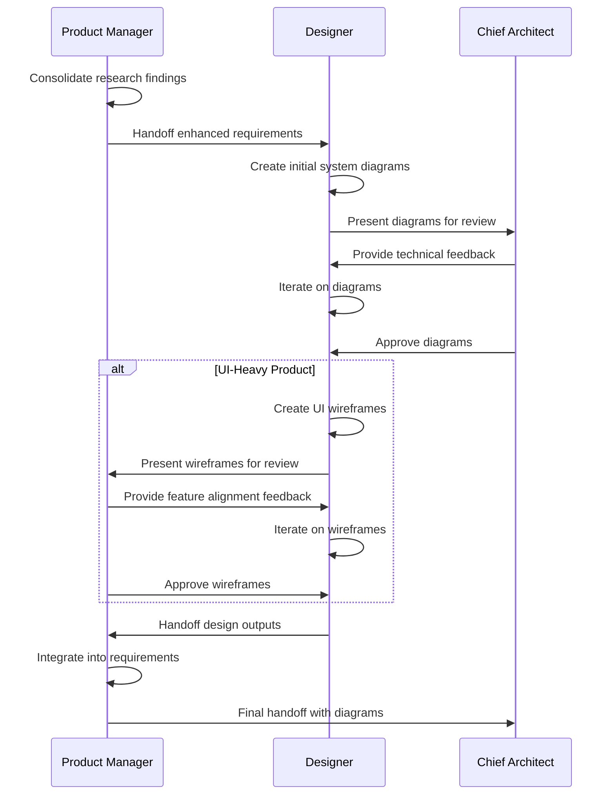
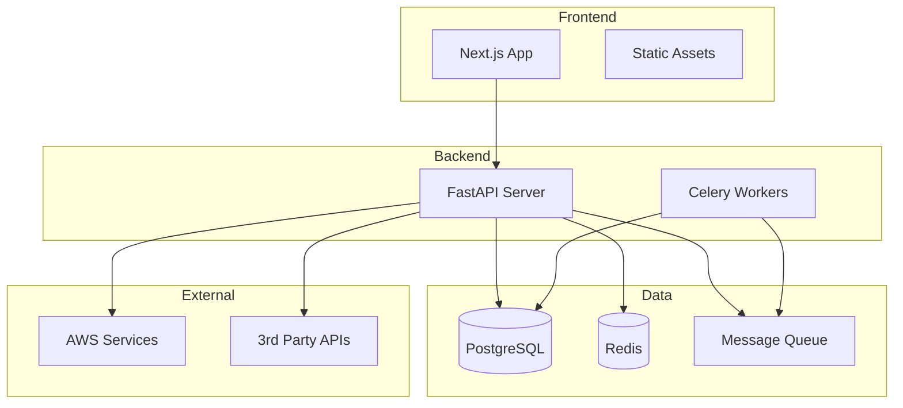

# Designer Collaboration Protocol

This protocol defines how the Designer collaborates with the Product Manager and Chief Architect to create system architecture diagrams and (conditionally) UI wireframes.

## Purpose

Enable structured design engagement that:
1. Creates professional system architecture diagrams for all products
2. Conditionally creates UI wireframes for UI-heavy products
3. Ensures technical accuracy through Chief Architect review
4. Operates efficiently in both MCP and collaboration modes

## Protocol Flow



## Step 1: Product Manager Initiates Design

### Trigger

After researchers complete their work (or immediately after discovery if no researchers), PM:
1. Has enhanced technical requirements (with research if applicable)
2. Has determined Designer scope (system diagrams always, wireframes conditionally)
3. Checks MCP availability for Designer
4. Communicates mode (MCP or collaboration) to Designer

### Handoff Package

PM provides Designer with:
- Enhanced technical requirements document
- Research reports (if researchers were engaged)
- Technology stack decisions
- Architecture overview (from requirements)
- Specific design scope (diagrams always, wireframes conditional)

## Step 2: Designer Creates System Diagrams

Designer creates system architecture diagrams (ALWAYS, regardless of product type).

### Diagram Types Needed

**Always Required**:
1. **High-Level Architecture**: Overall system components and relationships
2. **Component Diagram**: Detailed view of services and modules
3. **Data Flow Diagram**: How data moves through the system

**Conditionally Required**:
4. **Deployment Architecture**: Infrastructure and cloud resources (if complex)
5. **Integration Diagram**: External services and APIs (if many integrations)

### MCP Mode Process (Figma MCP Configured)

**Step 2.1: Analyze Requirements**
- Review technical requirements and research reports
- Identify key components, services, data stores
- Map integrations and external dependencies
- Understand deployment infrastructure

**Step 2.2: Create Diagrams in Figma**

Create professional diagrams with:
- Clean, consistent visual style
- Color-coded components (frontend: blue, backend: green, data: purple, external: orange)
- Clear labels for all components
- Connection lines showing data flow
- Cloud provider icons (AWS, etc.) where applicable
- Legend explaining colors and symbols

**Step 2.3: Export Initial Drafts**
- Export as PNG for immediate review
- Export as SVG for scalability
- Share Figma links for collaboration
- Save to `.cursor/diagrams/[product-name]/`

### Collaboration Mode Process (No MCP)

**Step 2.1: Analyze Requirements**
- Review technical requirements and research reports
- Identify key components, services, data stores
- Map integrations and external dependencies
- Understand deployment infrastructure

**Step 2.2: Create Mermaid Diagrams**

Create text-based diagrams with:
- Clear graph structure
- Labeled nodes for components
- Arrows showing data flow
- Subgraphs for component grouping
- Comments explaining complex relationships

**Example Mermaid Architecture**:


**Step 2.3: Document Diagrams**
- Include Mermaid code in markdown
- Add explanatory text for each diagram
- Document component responsibilities
- Save to technical requirements

## Step 3: Chief Architect Reviews Diagrams

Critical step: CA validates technical accuracy of system diagrams.

### CA Review Focus

**Technical Accuracy**:
- Are components correctly represented?
- Are data flows accurate?
- Are integrations properly shown?
- Is deployment architecture correct?

**Completeness**:
- Are all key components included?
- Are critical data stores shown?
- Are external dependencies captured?
- Is security boundary clear?

**Clarity**:
- Are diagrams easy to understand?
- Are labels clear and descriptive?
- Is the level of detail appropriate?
- Do diagrams tell a coherent story?

### CA Feedback Format

```markdown
## System Diagram Review - [Product Name]

### High-Level Architecture
**Status**: [Approved | Needs Revision]
**Feedback**:
- [Specific feedback point 1]
- [Specific feedback point 2]

### Component Diagram
**Status**: [Approved | Needs Revision]
**Feedback**:
- [Specific feedback point 1]
- [Specific feedback point 2]

### Data Flow Diagram
**Status**: [Approved | Needs Revision]
**Feedback**:
- [Specific feedback point 1]
- [Specific feedback point 2]

### Overall Assessment
[Summary of review, approval status]
```

## Step 4: Designer Iterates on Diagrams

Based on CA feedback, Designer updates diagrams.

### Iteration Process

**MCP Mode**:
1. Update Figma files based on feedback
2. Re-export updated diagrams
3. Share updated Figma links
4. Request CA re-review
5. Repeat until approved

**Collaboration Mode**:
1. Update Mermaid code based on feedback
2. Revise explanatory text
3. Request CA re-review
4. Repeat until approved

### Iteration Guidelines

- Address all CA feedback points
- Don't make unrelated changes during iteration
- Communicate rationale if disagreeing with feedback
- Aim for 2-3 iterations maximum
- Escalate to PM if stuck

## Step 5: Designer Creates UI Wireframes (Conditional)

**ONLY if product scope includes UI wireframes** (UI-heavy products).

### When UI Wireframes Are Needed

Refer to `.cursor/commands/engage-research-design.md` for triggers:
- Dashboard applications
- Complex forms or multi-step flows
- Consumer-facing B2C applications
- Rich interactive interfaces
- User explicitly requested UI design

### Identify Key User Flows

Designer identifies 3-5 critical user flows:
- Primary user journey (most important)
- Authentication/onboarding flow
- Core feature interactions
- Admin/settings flows (if applicable)
- Error and edge cases (if critical)

### MCP Mode Process (Figma MCP Configured)

**Step 5.1: Create Wireframes in Figma**

For each user flow:
- Low to mid-fidelity wireframes (not pixel-perfect)
- Focus on layout, hierarchy, interaction patterns
- Include key UI elements (buttons, forms, navigation)
- Show state changes (loading, success, error)
- Use placeholder content

**Step 5.2: Align with Design System**

If using template defaults (Shadcn UI):
- Use Shadcn component patterns
- Follow Radix UI accessibility guidelines
- Dark mode compatible layouts

**Step 5.3: Export and Share**
- Export wireframes as PNG
- Share Figma links for collaboration
- Document screen descriptions
- Save to `.cursor/wireframes/[product-name]/`

### Collaboration Mode Process (No MCP)

**Step 5.1: Create Text-Based Wireframe Descriptions**

For each user flow:
```markdown
### User Flow: [Flow Name]

**Screen 1: [Screen Name]**
Layout:
- Top: Navigation bar (logo left, user menu right)
- Center: [Main content description]
- Bottom: [Footer or actions]

Components:
- [Component 1: description]
- [Component 2: description]

Interactions:
- [Click action 1 → Result]
- [Click action 2 → Result]

**Screen 2: [Screen Name]**
[Repeat structure]
```

**Step 5.2: Simple ASCII Layout** (optional)
```
+------------------------------------------+
|  Logo              Search      User     |
+------------------------------------------+
|                                          |
|  [Card 1]  [Card 2]  [Card 3]  [Card 4] |
|                                          |
|  Recent Activity Table                   |
|  +------------------------------------+  |
|  | Col1    | Col2    | Col3    | ...  |  |
|  +------------------------------------+  |
|  | Data    | Data    | Data    | ...  |  |
|  +------------------------------------+  |
|                                          |
+------------------------------------------+
```

## Step 6: Product Manager Reviews Wireframes

PM validates wireframes align with product features.

### PM Review Focus

**Feature Alignment**:
- Do wireframes cover all core features?
- Are user flows logically structured?
- Are key interactions represented?
- Are edge cases considered?

**User Experience**:
- Is navigation intuitive?
- Are CTAs clear and prominent?
- Is information hierarchy appropriate?
- Does flow match user expectations?

**Completeness**:
- Are all critical screens included?
- Are error states shown?
- Are loading states addressed?
- Is responsive design considered?

### PM Feedback Format

```markdown
## Wireframe Review - [Product Name]

### Flow 1: [Flow Name]
**Status**: [Approved | Needs Revision]
**Feedback**:
- [Specific feedback point 1]
- [Specific feedback point 2]

### Flow 2: [Flow Name]
**Status**: [Approved | Needs Revision]
**Feedback**:
- [Specific feedback point 1]
- [Specific feedback point 2]

### Overall Assessment
[Summary of review, approval status]
```

## Step 7: Designer Iterates on Wireframes

Based on PM feedback, Designer updates wireframes.

### Iteration Process

Similar to diagram iteration:
1. Update based on feedback
2. Re-export/re-document
3. Request PM re-review
4. Repeat until approved

## Step 8: Design Specifications (Conditional, MCP Mode Only)

**ONLY if**: UI wireframes created AND MCP mode active.

### Design Spec Contents

**Color Palette**:
- Primary, secondary, accent colors
- Background and surface colors
- Text and border colors
- Success, warning, error states
- Align with Shadcn UI defaults if using template

**Typography**:
- Font families (primary and monospace)
- Heading scale (H1-H6 sizes and weights)
- Body text sizes and line heights
- Code and special text styles

**Spacing System**:
- Base unit (typically 4px or 8px)
- Spacing scale (e.g., 4, 8, 12, 16, 24, 32, 48, 64)
- Padding and margin standards
- Grid system (if applicable)

**Component Standards**:
- Button variants and states
- Form input styles
- Card and container patterns
- Navigation patterns
- Modal and overlay styles

### Design Spec Format

```markdown
---
product: [Product Name]
design_system: [Shadcn UI | Custom]
created_date: [Date]
---

## Color Palette

### Brand Colors
- Primary: #[hex] - [Usage]
- Secondary: #[hex] - [Usage]
- Accent: #[hex] - [Usage]

### UI Colors
- Background: #[hex]
- Surface: #[hex]
- Border: #[hex]
- Text Primary: #[hex]
- Text Secondary: #[hex]

### State Colors
- Success: #[hex]
- Warning: #[hex]
- Error: #[hex]
- Info: #[hex]

## Typography

### Font Families
- Primary: [Font name and fallbacks]
- Monospace: [Font name and fallbacks]

### Heading Scale
- H1: [size, weight, line-height]
- H2: [size, weight, line-height]
- H3: [size, weight, line-height]
- H4: [size, weight, line-height]

### Body Text
- Large: [size, weight, line-height]
- Base: [size, weight, line-height]
- Small: [size, weight, line-height]

## Spacing System

- Base: 4px
- Scale: 4, 8, 12, 16, 24, 32, 48, 64, 96, 128

## Component Standards

### Buttons
[Specifications for button variants]

### Forms
[Specifications for form inputs]

### Cards
[Specifications for card components]

[Additional components...]
```

Saved to: `.cursor/design-specs/[product-name].md`

## Step 9: Designer Handoff to Product Manager

Designer provides PM with complete design package.

### Design Package Contents

**Always Included**:
- System architecture diagrams (approved by CA)
- Diagram export files (PNG/SVG or Mermaid code)
- Figma links (MCP mode) or embedded diagrams (collaboration mode)

**Conditionally Included**:
- UI wireframes (if created, approved by PM)
- Wireframe export files or text descriptions
- Design specifications (if created, MCP mode only)

### Handoff Message Template

```markdown
## Design Package Complete - [Product Name]

**Mode**: [MCP | Collaboration]
**Date**: [Date]

### System Architecture Diagrams

**Status**: Approved by Chief Architect

1. **High-Level Architecture**
   - Figma: [Link] | Export: [Path] | Mermaid: [Code block]
   - Description: [Brief description]

2. **Component Diagram**
   - Figma: [Link] | Export: [Path] | Mermaid: [Code block]
   - Description: [Brief description]

3. **Data Flow Diagram**
   - Figma: [Link] | Export: [Path] | Mermaid: [Code block]
   - Description: [Brief description]

### UI Wireframes

**Status**: [Approved by PM | N/A]

[If created]:
1. **Flow: [Flow Name]**
   - Figma: [Link] | Exports: [Path] | Description: [Text description]
   - Screens: [List of screens]

2. **Flow: [Flow Name]**
   [Repeat structure]

### Design Specifications

**Status**: [Included | N/A]

[If created]:
- Document: [Path to design-specs file]
- Design System: [Shadcn UI | Custom]

### Next Steps

Design outputs ready for integration into technical requirements document.
```

## Step 10: Product Manager Integration

PM integrates design outputs into technical requirements.

### Update Technical Requirements

Add to requirements document:

**System Architecture Section**:
- Embed or link to system diagrams
- Add diagram descriptions
- Reference CA approval

**UI Design Section** (if applicable):
- Embed or link to wireframes
- Add wireframe descriptions
- Reference PM approval
- Link to design specifications

**Frontmatter Update**:
```yaml
design_outputs:
  system_diagrams:
    - name: "High-Level Architecture"
      figma_url: "[Link]"
      export_path: "docs/diagrams/architecture.png"
    - name: "Component Diagram"
      figma_url: "[Link]"
      export_path: "docs/diagrams/components.png"
  wireframes:
    created: true
    flows:
      - name: "[Flow Name]"
        figma_url: "[Link]"
        export_path: "docs/wireframes/flow-1/"
  design_specs:
    created: true
    document_path: ".cursor/design-specs/[product-name].md"
```

## Step 11: Final Handoff to Chief Architect

PM provides CA with complete package for final validation.

### Complete Package

- Enhanced technical requirements (with research if applicable)
- System architecture diagrams (already approved by CA)
- UI wireframes (if created)
- Design specifications (if created)
- Research reports (if researchers were engaged)

CA performs final validation and proceeds to Scrum Master handoff.

## Operational Mode Considerations

### MCP Mode Best Practices

**For Product Manager**:
- Expect professional-quality Figma outputs
- Review Figma files for interactive prototypes
- Leverage design specs for frontend implementation
- Share Figma links with engineering team

**For Designer**:
- Create polished, presentation-ready diagrams
- Use consistent visual style across all diagrams
- Provide multiple export formats (PNG, SVG)
- Maintain organized Figma project structure
- Create interactive prototypes for complex flows

**For Chief Architect**:
- Review Figma files for detailed component views
- Provide specific, actionable feedback
- Leverage visual clarity for validation

### Collaboration Mode Best Practices

**For Product Manager**:
- Expect functional, text-based outputs
- Focus on content and structure over visual polish
- Mermaid diagrams are sufficient for documentation
- Text descriptions guide frontend implementation

**For Designer**:
- Create clear, readable Mermaid diagrams
- Provide detailed text descriptions
- Focus on structure and layout over aesthetics
- Ensure diagrams render correctly in markdown

**For Chief Architect**:
- Focus on technical accuracy in Mermaid graphs
- Provide feedback on structure and relationships
- Collaborate on refining text-based representations

## Success Criteria

Successful designer collaboration achieves:
- [ ] System diagrams created for all products (always)
- [ ] Diagrams reviewed and approved by Chief Architect
- [ ] UI wireframes created for UI-heavy products (conditional)
- [ ] Wireframes reviewed and approved by Product Manager
- [ ] Design specifications created when appropriate (conditional, MCP)
- [ ] All outputs integrated into technical requirements
- [ ] CA performs final validation with complete design package

## Integration with Product Development

1. **Discovery Phase**: PM completes product discovery
2. **Research Phase**: Researchers conduct domain/vertical research (conditional)
3. **Consolidation**: PM enhances requirements with research
4. **System Diagrams**: Designer creates diagrams, CA reviews iteratively
5. **UI Wireframes**: Designer creates wireframes (conditional), PM reviews
6. **Design Specs**: Designer creates specs (conditional, MCP mode)
7. **Integration**: PM integrates design outputs into requirements
8. **Final Validation**: CA validates complete package
9. **Sprint Planning**: SM uses complete requirements with visuals

## Related Documentation

- [Designer Agent](.cursor/agents/designer.md)
- [Figma MCP Setup](.cursor/docs/mcp-setup-figma.md)
- [Researcher Collaboration Protocol](.cursor/protocols/researcher-collaboration.md)
- [Engage Research and Design Command](.cursor/commands/engage-research-design.md)
- [Handoff: PM to Architect](.cursor/protocols/handoff-pm-to-architect.md)
- [Product Manager Agent](.cursor/agents/product-manager.md)
- [Chief Architect Agent](.cursor/agents/chief-architect.md)

## Notes

- System diagrams are ALWAYS created, regardless of product type
- UI wireframes are CONDITIONAL based on product characteristics
- Design specs are ONLY created in MCP mode for UI-heavy products
- CA approval is MANDATORY for system diagrams
- PM approval is MANDATORY for UI wireframes
- MCP mode produces professional-quality outputs suitable for client presentations
- Collaboration mode produces functional outputs suitable for internal engineering
- Designer collaboration happens AFTER research (if research engaged)
- All design outputs are preserved in technical requirements for implementation reference
