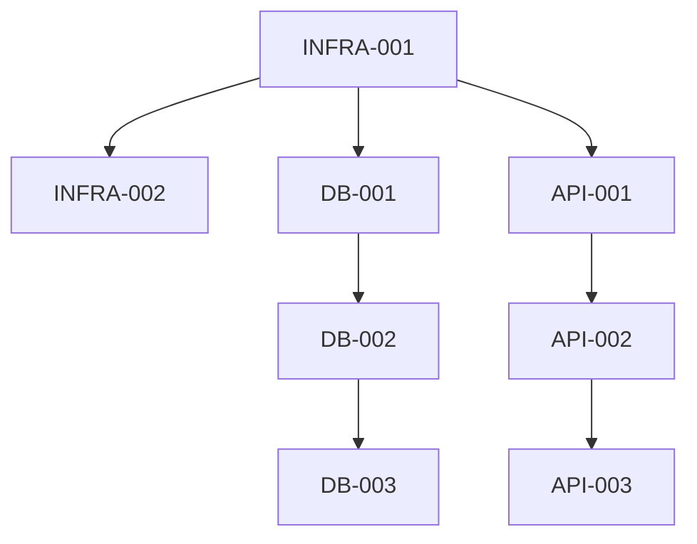

# Handoff Protocol: Product Manager to Scrum Master

This document defines the handoff protocol when Chief Architect has validated technical requirements and Scrum Master needs to create the sprint plan.

## When to Initiate Handoff

After:
1. Product Manager completes product discovery
2. Technical requirements document generated and approved
3. Chief Architect validates technical feasibility
4. Chief Architect updates agent files with project context
5. Architecture patterns defined

## Prerequisites

Before handing off to Scrum Master:

- [ ] Technical requirements document validated by Chief Architect
- [ ] GitHub repository configured in create-github-issue.sh
- [ ] Sprint plan file name determined
- [ ] Agent files updated with project-specific context
- [ ] Team member preliminary assignments identified

## Handoff Message Template

Use this template when notifying Scrum Master:

```markdown
@scrum-master

Technical requirements for **[Product Name]** have been validated by Chief Architect.

## Sprint Planning Request

Please create a sprint plan for this product following the established template patterns.

## Technical Requirements Document

File: `.cursor/plans/project-init/[filename]-technical-requirements.plan.md`

## Sprint Plan File

Create: `.cursor/plans/project-init/[product-name]-sprint.plan.md`

This file name is already configured in `.cursor/scripts/create-github-issue.sh`.

## Sprint Plan Requirements

### 1. Follow Template Pattern

Use `.cursor/plans/sprint-plan-example.plan.md` as the reference for:
- Frontmatter structure with todos
- Phase organization
- Mermaid dependency graphs
- Review checkpoints
- Git commit conventions

### 2. Ticket Naming Convention

Use these prefixes based on work type:
- `FEAT-###`: Feature development
- `API-###`: API endpoint work
- `UI-###`: UI components
- `DB-###`: Database/schema work
- `TEST-###`: Testing tasks
- `DOC-###`: Documentation
- `INFRA-###`: Infrastructure/DevOps
- `OBS-###`: Observability setup

### 3. Table Format

Follow `table-header.md` format:

```markdown
| Ticket | GitHub Issue | Completed | Description | Owner | Depends On | Plan File |
| ------ | ------------ | --------- | ----------- | ----- | ---------- | --------- |
```

### 4. Phase Structure

Organize into iterative phases:

**Phase 1: Foundation** (Week 1)
- Project structure setup
- Infrastructure (Docker, Make, LocalStack)
- Database schema
- Authentication (if required)
- Basic CI/CD

**Phase 2: Core Features** (Week 2)
- Primary user flows
- Key API endpoints
- Essential UI components
- AI/ML integration (if required)

**Phase 3+: Features & Polish** (Week 3+)
- Secondary features
- External integrations
- Performance optimization
- Documentation completion

### 5. Todos List

Generate frontmatter todos for each ticket:

```yaml
todos:
  - id: feat-001
    content: FEAT-001 - Setup project structure
    status: pending
  - id: api-001
    content: API-001 - Create base FastAPI app
    status: pending
```

### 6. Dependency Graphs

Include mermaid diagrams showing:
- Phase dependencies
- Ticket dependencies within phases
- Critical path
- Parallel work opportunities

### 7. Team Assignments

Assign tickets to appropriate engineers:
- **Backend Engineer**: API, business logic, database
- **Frontend Engineer**: UI components, pages, client logic
- **AWS Engineer**: Infrastructure, cloud services, deployment
- **Test Developer**: Unit tests, integration tests, E2E tests
- **Notion Engineer**: Documentation sync (if MCP enabled)
- **Linear Engineer**: Issue tracking setup (if MCP enabled)
- **Discord Engineer**: Notifications (if MCP enabled)

## Key Product Details

- **Product Name**: [Name]
- **Uses Template Defaults**: [Yes/No]
- **Target Scale**: [Prototype/Small/Medium/Large]
- **Core Features**: [List must-have features]
- **AWS Services**: [List required services]
- **MCP Integrations**: [Enabled/Disabled]
- **Database**: [PostgreSQL/Cassandra/Other]

## Mode Recommendation

Please switch to **Plan mode** for sprint planning to ensure:
- Thorough analysis of requirements
- Proper ticket breakdown
- Realistic effort estimation
- No implementation until plan approved

Use SwitchMode tool if available:
```json
{
  "target_mode_id": "plan",
  "explanation": "Switching to Plan mode for comprehensive sprint planning without implementation"
}
```

## Next Steps

After sprint plan creation:

1. Review plan with Product Manager
2. Adjust based on feedback
3. Finalize sprint plan
4. Generate GitHub issues using create-github-issue.sh
5. If MCP enabled: Sync to Notion, Linear, Discord
6. Sprint kickoff

## Questions for Scrum Master

- Clarification on any requirements
- Team capacity constraints
- Timeline expectations
- Risk mitigation strategies
```

## Expected Scrum Master Actions

Scrum Master should:

### 1. Review Technical Requirements

Thoroughly read the technical requirements document to understand:
- Product vision and user needs
- Core features and priorities
- Technology stack
- Scale and performance requirements
- Constraints and risks

### 2. Switch to Plan Mode

Use SwitchMode tool to enter Plan mode:
- Ensures careful planning without premature implementation
- Allows collaborative plan refinement
- Prevents accidental code changes during planning

### 3. Break Down Features into Tickets

For each must-have feature:

**Analyze Complexity**:
- What API endpoints are needed?
- What database tables/models are required?
- What UI components are needed?
- What tests are necessary?
- What documentation is required?

**Create Tickets**:
- One ticket = ~1-2 days of work
- Clear description and acceptance criteria
- Dependencies explicitly stated
- Owner assigned based on expertise

**Example Breakdown** for "User Authentication" feature:

```markdown
| Ticket  | Description | Owner | Depends On |
|---------|-------------|-------|------------|
| DB-001  | Create users table schema | Backend Engineer | - |
| API-002 | Implement user registration endpoint | Backend Engineer | DB-001 |
| API-003 | Implement login endpoint with JWT | Backend Engineer | DB-001 |
| UI-004  | Create registration form component | Frontend Engineer | API-002 |
| UI-005  | Create login form component | Frontend Engineer | API-003 |
| TEST-006 | Unit tests for auth endpoints | Test Developer | API-002, API-003 |
| TEST-007 | E2E tests for auth flows | Test Developer | UI-004, UI-005 |
| DOC-008 | Document auth API endpoints | Backend Engineer | API-002, API-003 |
```

### 4. Organize into Phases

Group tickets into logical phases:

**Phase 1 Example (Foundation)**:
```markdown
## Phase 1: Foundation Setup (Week 1)

### Infrastructure Tickets
- INFRA-001: Setup Docker Compose configuration
- INFRA-002: Configure LocalStack for AWS emulation
- INFRA-003: Setup Make commands for dev workflow
- INFRA-004: Configure SigNoz observability

### Database Tickets
- DB-001: Design database schema
- DB-002: Setup PostgreSQL with Docker
- DB-003: Create initial migrations
- DB-004: Setup database seeding

### Core API Tickets
- API-001: Create FastAPI application structure
- API-002: Setup middleware (CORS, logging)
- API-003: Implement health check endpoints
- API-004: Configure OpenAPI/Swagger docs
```

### 5. Create Dependency Graph

Visualize dependencies with mermaid:



### 6. Generate Sprint Plan Document

Create complete sprint plan file with:

**Frontmatter**:
```yaml
---
name: [Product Name] Sprint Plan
overview: [Brief sprint description]
todos:
  [List of all tickets with status: pending]
isProject: false
---
```

**Content Sections**:
- Sprint goal and duration
- Definition of done
- Sprint backlog organized by phase
- Dependency graphs
- Team assignments
- Review checkpoints
- Git commit conventions

### 7. Include Review Checkpoints

Define when reviews happen:

```markdown
## Review Checkpoints

| Week | Review Focus | Reviewer |
|------|--------------|----------|
| End of Week 1 | Foundation setup complete | Chief Architect |
| End of Week 2 | Core features functional | Product Manager |
| End of Week 3 | Full MVP ready | User/Stakeholder |
```

### 8. Document Velocity Assumptions

Include capacity planning:

```markdown
## Team Capacity

- Backend Engineer: 40 hours/week (8 story points)
- Frontend Engineer: 40 hours/week (8 story points)
- AWS Engineer: 20 hours/week (4 story points)
- Test Developer: 40 hours/week (8 story points)

**Total Sprint Capacity**: 28 story points
**Committed**: 25 story points (buffer for unknowns)
```

### 9. Add MCP Integration Tasks

If MCP integrations enabled, add tickets:

```markdown
### MCP Integration Setup

| Ticket | Description | Owner | Depends On |
|--------|-------------|-------|------------|
| DOC-001 | Sync sprint plan to Notion | Notion Engineer | - |
| DOC-002 | Create Linear project and issues | Linear Engineer | - |
| DOC-003 | Setup Discord sprint channel | Discord Engineer | - |
```

### 10. Notify Product Manager

After creating sprint plan:

```markdown
@product-manager

Sprint plan created for: **[Product Name]**

## Sprint Plan File

File: `.cursor/plans/project-init/[product-name]-sprint.plan.md`

## Sprint Overview

- **Duration**: [X weeks]
- **Total Tickets**: [N tickets]
- **Phases**: [Number of phases]
- **Team Capacity**: [Story points]
- **Sprint Goal**: [Goal statement]

## Breakdown by Phase

**Phase 1 - Foundation** ([N] tickets, Week 1):
- [Brief summary]

**Phase 2 - Core Features** ([N] tickets, Week 2):
- [Brief summary]

**Phase 3 - Features & Polish** ([N] tickets, Week 3+):
- [Brief summary]

## Ready for Review

Please review the sprint plan and approve before:
1. Generating GitHub issues
2. MCP integration sync (if enabled)
3. Sprint kickoff

## Next Steps

After approval:
1. Run create-github-issue.sh for each ticket
2. Notion Engineer syncs to Notion
3. Linear Engineer creates Linear issues
4. Discord Engineer announces sprint start
5. Begin Sprint Week 1
```

## Sprint Plan Quality Checklist

Before finalizing sprint plan:

- [ ] All must-have features have tickets
- [ ] Each ticket is 1-2 days of effort
- [ ] Dependencies are clearly stated
- [ ] No circular dependencies
- [ ] Each ticket has clear acceptance criteria
- [ ] Owners assigned based on expertise
- [ ] Phase organization is logical
- [ ] Mermaid graphs show dependencies
- [ ] Review checkpoints defined
- [ ] Git commit convention documented
- [ ] Table format matches table-header.md
- [ ] Frontmatter todos match tickets
- [ ] MCP integration tasks included (if enabled)
- [ ] Follows sprint-plan-example.plan.md pattern

## Common Patterns

### Feature Breakdown Pattern

For each feature:
1. Database schema (DB-###)
2. API endpoints (API-###)
3. UI components (UI-###)
4. Unit tests (TEST-###)
5. Integration tests (TEST-###)
6. Documentation (DOC-###)

### Infrastructure Pattern

Week 1 foundation:
1. Docker setup (INFRA-###)
2. Database setup (DB-###)
3. API framework setup (API-###)
4. Frontend framework setup (UI-###)
5. CI/CD setup (INFRA-###)
6. Observability setup (OBS-###)

### AI/ML Integration Pattern

If AI/ML features:
1. Model selection/setup (FEAT-###)
2. HuggingFace integration (API-###)
3. LangChain agent setup (API-###)
4. Bedrock configuration (if used) (INFRA-###)
5. Phoenix observability (OBS-###)

## Edge Cases

### Prototype Scale

If prototype scale:
- Focus on LocalStack only
- Minimal AWS services
- Basic observability
- Rapid iteration

### Large Scale

If large scale:
- Include scalability tickets (caching, CDN, load balancing)
- Comprehensive AWS setup
- Advanced monitoring and alerting
- Performance testing tickets

### No Database

If no database needed:
- Skip DB tickets
- Static site or serverless approach
- S3 for any needed storage

### Heavy AI/ML

If AI/ML heavy:
- Separate phase for model integration
- Phoenix observability priority
- GPU compute considerations (EC2)
- Model versioning strategy

## Post-Creation Actions

After sprint plan created and approved:

1. **Generate GitHub Issues**:
   ```bash
   for ticket in FEAT-001 FEAT-002 API-001 ...; do
     .cursor/scripts/create-github-issue.sh $ticket
   done
   ```

2. **MCP Integration** (if enabled):
   - Notion Engineer syncs sprint plan
   - Linear Engineer creates issues
   - Discord Engineer announces sprint

3. **Sprint Kickoff**:
   - Review sprint goal with team
   - Confirm capacity and commitments
   - Address questions
   - Begin Week 1

4. **Daily Standups**:
   - Track progress on tickets
   - Identify blockers
   - Update ticket status

5. **Sprint Review** (at milestones):
   - Demo completed work
   - Gather feedback
   - Adjust plan if needed

## Documentation

Sprint plan serves as:
- Source of truth for sprint scope
- Reference for GitHub issue creation
- Guide for team execution
- Historical record of decisions

Keep it updated as sprint progresses.
