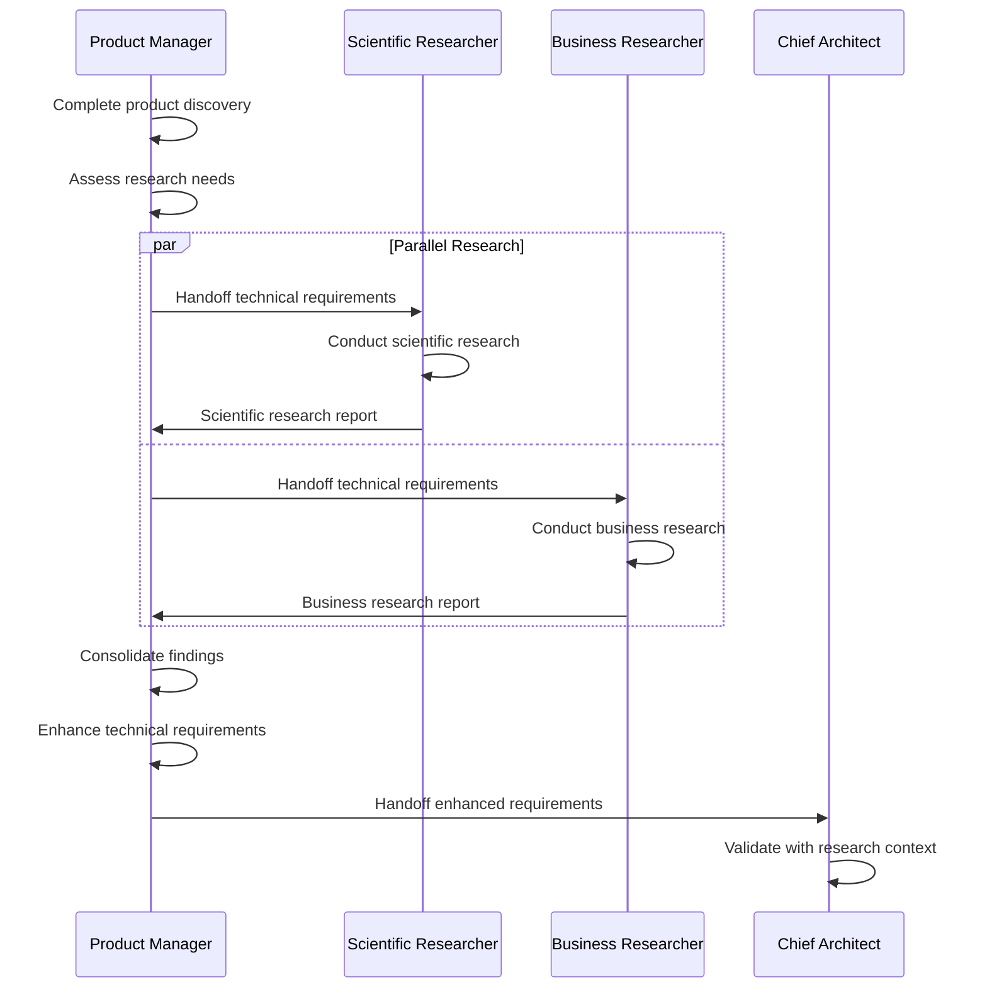

# Researcher Collaboration Protocol

This protocol defines how Scientific Researcher and Business Researcher collaborate with the Product Manager and Chief Architect during the product development process.

## Purpose

Enable structured research engagement that:
1. Validates technical and business approaches against domain expertise
2. Identifies risks and requirements early in the process
3. Provides research-backed recommendations for implementation
4. Operates efficiently in both MCP and collaboration modes

## Protocol Flow



## Step 1: Product Manager Initiates Research

### Trigger

After completing product discovery and generating initial technical requirements, PM:
1. Runs `.cursor/commands/engage-research-design.md`
2. Determines which researchers to engage
3. Checks MCP availability for each researcher
4. Communicates mode (MCP or collaboration) to researchers

### Handoff Package

PM provides each researcher with:
- Technical requirements document (initial draft)
- Product overview and features
- Technology stack decisions
- Target users and scale
- Specific research questions or areas of concern

## Step 2: Scientific Researcher Conducts Research

### Scope Definition

Scientific Researcher identifies:
- Specific technical domain (AI/ML, bioinformatics, physics, etc.)
- Key technical challenges requiring research
- Current best practices to investigate
- Potential risks to explore

### Research Activities

**MCP Mode** (Claude MCP configured):
1. Query scientific literature via Claude MCP
2. Research state-of-the-art approaches
3. Validate technical assumptions against current research
4. Identify proven technologies and methods
5. Compile citations and references

**Collaboration Mode** (No MCP):
1. Apply general domain knowledge
2. Identify standard best practices
3. Provide high-level technical guidance
4. Collaborate with Chief Architect for validation

### Deliverable: Scientific Research Report

Format:
```yaml
---
research_type: scientific
domain: [Specific domain]
mode: [mcp | collaboration]
engaged_date: [Date]
---

## Domain Overview
[Technical domain description]

## Key Findings
[Research-backed insights or general guidance]

## Technology Recommendations
[Recommended technologies with rationale]

## Technical Risks
[Identified risks with mitigations]

## Domain-Specific Requirements
[Additional requirements discovered]

## References
[Citations if MCP mode, general guidance notes if collaboration mode]
```

Saved to: `.cursor/research/scientific-[product-name]-[date].md`

## Step 3: Business Researcher Conducts Research

### Scope Definition

Business Researcher identifies:
- Specific business vertical (e-commerce, fintech, healthcare, etc.)
- Regulatory and compliance requirements
- Market-specific challenges
- Industry best practices to investigate

### Research Activities

**MCP Mode** (Claude MCP configured):
1. Query industry reports via Claude MCP
2. Research regulatory requirements
3. Validate business model viability
4. Identify compliance standards
5. Compile citations and references

**Collaboration Mode** (No MCP):
1. Apply general business knowledge
2. Identify standard regulatory considerations
3. Provide high-level compliance guidance
4. Collaborate with Chief Architect for validation

### Deliverable: Business Research Report

Format:
```yaml
---
research_type: business
vertical: [Specific vertical]
mode: [mcp | collaboration]
engaged_date: [Date]
---

## Business Vertical Overview
[Vertical description]

## Market Insights
[Industry analysis or general business guidance]

## Regulatory & Compliance Requirements
[Specific regulations or compliance considerations]

## Feature Recommendations
[Vertical-specific features with rationale]

## Business Risks
[Identified risks with mitigations]

## Vertical-Specific Requirements
[Additional requirements discovered]

## References
[Citations if MCP mode, general guidance notes if collaboration mode]
```

Saved to: `.cursor/research/business-[product-name]-[date].md`

## Step 4: Product Manager Consolidates Findings

### Review Research Reports

PM reviews both reports (if both engaged) for:
- Consistency between scientific and business recommendations
- Conflicts or tensions to resolve
- New requirements discovered
- Risk mitigations needed
- Technology or feature additions

### Consolidation Activities

1. **Merge Recommendations**:
   - Combine technology recommendations from both researchers
   - Resolve any conflicts (e.g., security vs. performance)
   - Prioritize based on product goals

2. **Update Requirements**:
   - Add domain-specific requirements from scientific research
   - Add vertical-specific requirements from business research
   - Update technology stack based on recommendations
   - Document compliance needs identified

3. **Risk Assessment**:
   - Consolidate risks from both reports
   - Prioritize by impact and likelihood
   - Document mitigation strategies
   - Flag for Chief Architect review

4. **Reference Integration**:
   - Link to research reports in technical requirements
   - Include key citations (if MCP mode)
   - Preserve research rationale for decisions

### Deliverable: Enhanced Technical Requirements

Updated technical requirements document with new sections:
- Research findings summary
- Consolidated recommendations
- Domain/vertical-specific requirements
- Risk assessment with research backing
- References to detailed research reports

## Step 5: Handoff to Chief Architect

### Enhanced Handoff Package

PM provides CA with:
- Enhanced technical requirements document
- Scientific research report (if engaged)
- Business research report (if engaged)
- Consolidated risk assessment
- Specific questions for CA validation

### Handoff Message Template

```markdown
## Enhanced Technical Requirements - Ready for Review

**Product**: [Product name]
**Date**: [Date]

### Research Engagement Summary

**Scientific Researcher**:
- Engaged: [Yes/No]
- Mode: [MCP/Collaboration/N/A]
- Domain: [Domain]
- Key Findings: [1-2 sentence summary]
- Report: [Path to report]

**Business Researcher**:
- Engaged: [Yes/No]
- Mode: [MCP/Collaboration/N/A]
- Vertical: [Vertical]
- Key Findings: [1-2 sentence summary]
- Report: [Path to report]

### Key Recommendations

**Technology Additions**:
- [Recommendation 1 with rationale]
- [Recommendation 2 with rationale]

**New Requirements**:
- [Requirement 1]
- [Requirement 2]

**Compliance Needs**:
- [Compliance 1]
- [Compliance 2]

### Validation Needed

Please review:
1. [Specific technical validation needed]
2. [Architecture implications of recommendations]
3. [Risk mitigation strategies]

### Next Steps

After your validation:
- Designer will create system diagrams
- We'll proceed to sprint planning with SM
```

## Step 6: Chief Architect Validation

### Validation Activities

CA reviews enhanced requirements with research context:
1. **Technical Feasibility**: Validate recommended technologies
2. **Architecture Alignment**: Ensure recommendations fit architecture
3. **Risk Assessment**: Review identified risks and mitigations
4. **Implementation Complexity**: Assess effort for recommendations
5. **Trade-offs**: Identify any competing concerns

### CA Response

CA provides feedback:
- Approved: Recommendations accepted as-is
- Approved with Modifications: Recommendations adjusted
- Concerns Raised: Issues that need resolution

### Iteration (If Needed)

If CA raises concerns:
1. CA and PM discuss issues
2. PM may re-engage researchers for clarification
3. Researchers provide additional guidance
4. PM updates requirements
5. CA re-validates

## Operational Mode Considerations

### MCP Mode Best Practices

**For Product Manager**:
- Expect comprehensive, detailed reports (5-10 pages)
- Review citations and references carefully
- Allow researchers adequate time for deep research
- Use findings to justify technology decisions

**For Researchers**:
- Provide full citations for all recommendations
- Include recent research and current best practices
- Be specific and detailed in recommendations
- Document research methodology

**For Chief Architect**:
- Validate research findings against architecture
- Leverage research depth for decision-making
- Request clarification on specific citations if needed

### Collaboration Mode Best Practices

**For Product Manager**:
- Expect concise, high-level reports (1-2 pages)
- Focus on practical, proven approaches
- Faster turnaround than MCP mode
- Use findings as general guidance

**For Researchers**:
- Provide general domain/vertical knowledge
- Focus on standard best practices
- Be practical and concise
- Collaborate closely with CA

**For Chief Architect**:
- Treat as lightweight domain guidance
- Validate recommendations against experience
- Engage researchers in collaborative refinement

## Parallel Research Execution

### Why Parallel?

- Scientific and business research are independent
- Saves time by conducting simultaneously
- Researchers don't need each other's outputs
- PM consolidates after both complete

### Coordination

PM manages parallel execution:
1. Hand off to both researchers simultaneously
2. Set expected completion timeframe
3. Monitor progress independently
4. Wait for both reports before consolidation
5. Resolve any conflicts during consolidation

### Timeframe Expectations

**MCP Mode**:
- Deep research: Allocate adequate time for quality
- Comprehensive reports take longer to produce
- Worth the wait for complex domains/verticals

**Collaboration Mode**:
- Lightweight guidance: Faster turnaround
- Concise reports completed quickly
- Suitable for straightforward products

## Success Criteria

Successful researcher collaboration achieves:
- [ ] Researchers engaged based on product characteristics
- [ ] Appropriate mode (MCP or collaboration) used
- [ ] Research reports provide actionable recommendations
- [ ] Technical requirements enhanced with research findings
- [ ] Risks identified and mitigation strategies documented
- [ ] CA validates requirements with research context
- [ ] Process remains efficient and doesn't create bottlenecks

## Integration with Product Development

1. **Discovery Phase**: PM completes product discovery
2. **Assessment**: Determine researcher needs
3. **Parallel Research**: SR and BR work simultaneously
4. **Consolidation**: PM merges findings into requirements
5. **Designer Engagement**: Designer creates diagrams (next protocol)
6. **CA Validation**: CA reviews enhanced requirements with research context
7. **Sprint Planning**: SM uses research-backed requirements

## Related Documentation

- [Scientific Researcher Agent](.cursor/agents/scientific-researcher.md)
- [Business Researcher Agent](.cursor/agents/business-researcher.md)
- [Engage Research and Design Command](.cursor/commands/engage-research-design.md)
- [Designer Collaboration Protocol](.cursor/protocols/designer-collaboration.md)
- [Handoff: PM to Architect](.cursor/protocols/handoff-pm-to-architect.md)
- [Product Manager Agent](.cursor/agents/product-manager.md)
- [Chief Architect Agent](.cursor/agents/chief-architect.md)

## Notes

- Research engagement is conditional, not mandatory
- MCP mode provides deeper insights but uses external API credits
- Collaboration mode is faster and uses only Cursor credits
- PM is responsible for consolidation and conflict resolution
- Research reports are preserved for future reference
- CA validation is critical before proceeding to sprint planning
