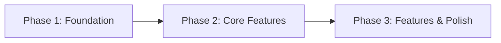
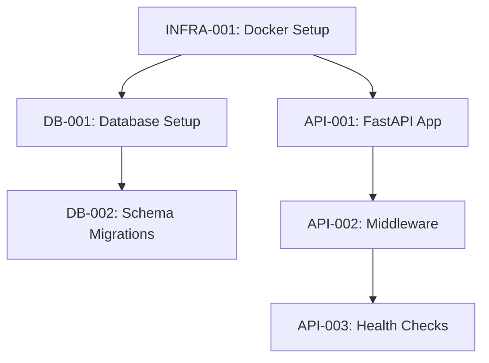
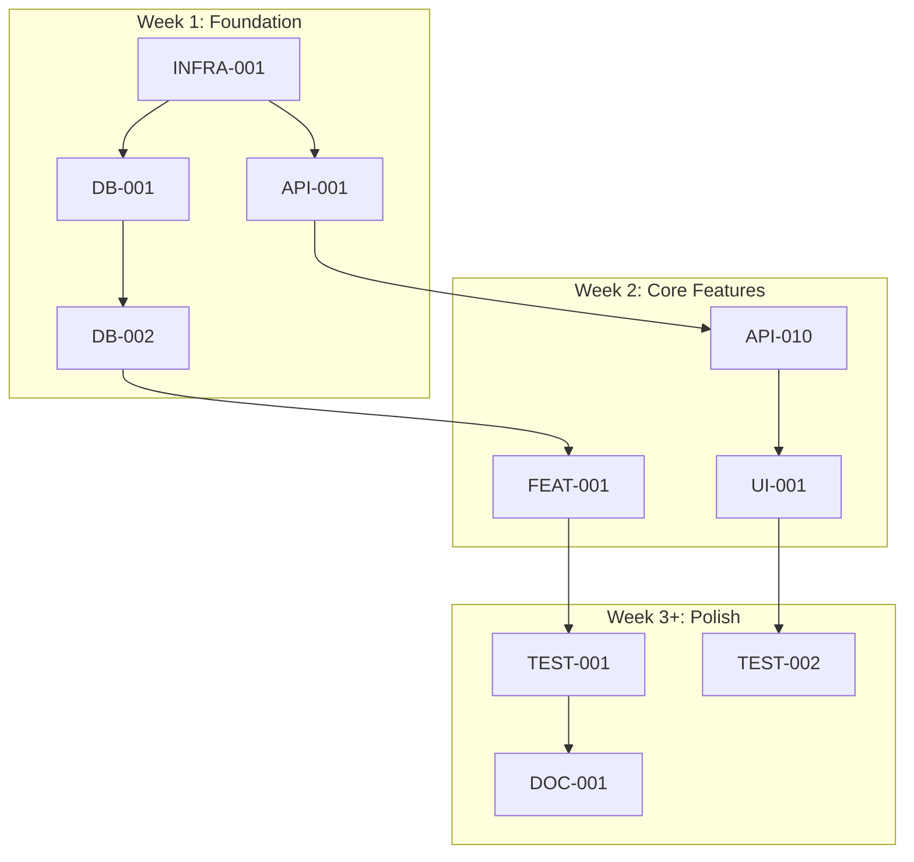
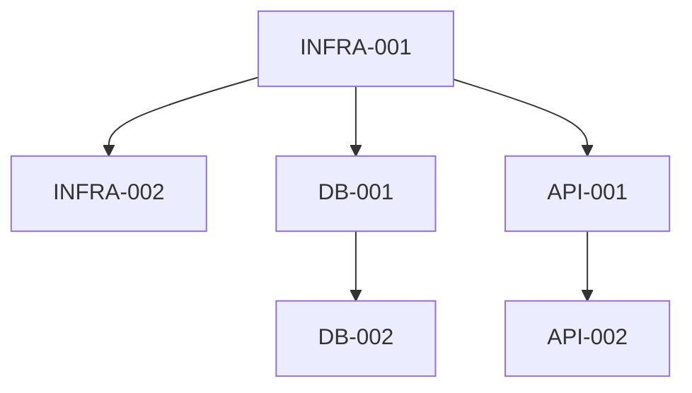

# Sprint Plan Structure Guide

This guide documents the structure, ticket naming conventions, and phase organization patterns for sprint plans generated from product discovery.

## Sprint Plan File Location

All sprint plans for new products are created in:

`.cursor/plans/project-init/[product-name]-sprint.plan.md`

Example: `.cursor/plans/project-init/task-management-app-sprint.plan.md`

## File Structure

### Frontmatter (YAML)

```yaml
---
name: [Product Name] Sprint Plan
overview: [One-sentence description of sprint goals]
todos:
  - id: feat-001
    content: FEAT-001 - [Feature description]
    status: pending
  - id: api-001
    content: API-001 - [API description]
    status: pending
  [... all tickets as todos ...]
isProject: false
---
```

**Frontmatter Requirements**:
- `name`: Product name + "Sprint Plan"
- `overview`: Brief sprint goal (1-2 sentences)
- `todos`: Every ticket listed with id, content, status
- `isProject`: Always false for sprint plans
- Todo IDs match ticket IDs (lowercase with hyphens)
- Todo content includes full ticket ID and description
- All todos start with `status: pending`

### Content Structure

```markdown
# [Product Name] Sprint Plan

**Duration**: [X weeks]
**Goal**: [Clear sprint goal statement]
**Definition of Done**: [Specific MVP completion criteria]

---

## Sprint Backlog

### Phase 1: Foundation (Week 1)

[Mermaid dependency graph for Phase 1]

| Ticket | GitHub Issue | Completed | Description | Owner | Depends On | Plan File |
| ------ | ------------ | --------- | ----------- | ----- | ---------- | --------- |
| [Ticket rows following format]

### Phase 2: Core Features (Week 2)

[Mermaid dependency graph for Phase 2]

| Ticket | GitHub Issue | Completed | Description | Owner | Depends On | Plan File |
| ------ | ------------ | --------- | ----------- | ----- | ---------- | --------- |
| [Ticket rows following format]

### Phase 3+: Features & Polish (Week 3+)

[Mermaid dependency graph for Phase 3]

| Ticket | GitHub Issue | Completed | Description | Owner | Depends On | Plan File |
| ------ | ------------ | --------- | ----------- | ----- | ---------- | --------- |
| [Ticket rows following format]

---

## Git Commit Convention

All commits must reference the ticket number:

```bash
git commit -m "[FEAT-001] Setup project structure"
git commit -m "[API-002] Create user authentication endpoint"
git commit -m "[UI-003] Build login form component"
```

---

## Dependencies Graph

[Master dependency graph showing all phases]

---

## Review Checkpoints

| Week | Review Focus | Reviewer |
|------|--------------|----------|
| End of Week 1 | Foundation complete | Chief Architect |
| End of Week 2 | Core features functional | Product Manager |
| End of Week 3+ | Full MVP ready | User/Stakeholder |
```

## Ticket Naming Convention

### Prefix Categories

| Prefix | Purpose | Owner |
|--------|---------|-------|
| `FEAT-###` | Feature development (business logic, workflows) | Backend Engineer |
| `API-###` | API endpoint implementation | Backend Engineer |
| `UI-###` | UI components and pages | Frontend Engineer |
| `DB-###` | Database schema, migrations, models | Backend Engineer |
| `AGENT-###` | Agent architecture and LangChain implementation | AI Engineer |
| `MODEL-###` | Model training, tuning, deployment | ML Engineer |
| `TEST-###` | Testing (unit, integration, E2E) | Test Developer |
| `DOC-###` | Documentation (API docs, README, guides) | Various |
| `INFRA-###` | Infrastructure, DevOps, deployment | AWS Engineer |
| `OBS-###` | Observability, monitoring, logging | AWS Engineer |

### Numbering Convention

- Sequential within each prefix category
- Start at 001 for each category
- Zero-padded to 3 digits
- Examples: `FEAT-001`, `FEAT-002`, `API-001`, `UI-001`

### Naming Examples

**Good Ticket Names**:
- `FEAT-001` - Setup project structure
- `API-002` - Create user registration endpoint
- `UI-003` - Build user registration form
- `DB-004` - Create users table schema
- `AGENT-005` - Implement RAG chain for document retrieval
- `MODEL-006` - Fine-tune classification model on domain data
- `TEST-007` - Unit tests for user registration
- `DOC-008` - Document authentication API
- `INFRA-009` - Configure Docker Compose
- `OBS-010` - Setup SigNoz dashboards

**Bad Ticket Names** (avoid):
- `FEATURE-1` - Inconsistent format
- `api-002` - Not uppercase
- `UI-3` - Not zero-padded
- `AUTH-001` - Use standard prefixes only

## Table Format

### Header Row

Must exactly match `table-header.md`:

```markdown
| Ticket | GitHub Issue | Completed | Description | Owner | Depends On | Plan File |
| ------ | ------------ | --------- | ----------- | ----- | ---------- | --------- |
```

### Data Rows

```markdown
| FEAT-001 | #14 | Yes | Setup project structure | Backend Engineer | - | .cursor/plans/feat-001_setup.plan.md |
```

**Column Specifications**:

1. **Ticket**: Ticket ID (e.g., `FEAT-001`)
2. **GitHub Issue**: GitHub issue number (e.g., `#14`) or `TBD` before creation
3. **Completed**: `Yes` or `No`
4. **Description**: Brief description (< 50 chars preferred)
5. **Owner**: Agent role (e.g., `Backend Engineer`, `Frontend Engineer`)
6. **Depends On**: Comma-separated ticket IDs or `-` for no dependencies
7. **Plan File**: Relative path to detailed plan file

### Owner Values

Use exact agent role names:
- `Backend Engineer`
- `Frontend Engineer`
- `AWS Engineer`
- `Test Developer`
- `Chief Architect` (for architectural tasks)
- `Notion Engineer` (if MCP enabled)
- `Linear Engineer` (if MCP enabled)
- `Discord Engineer` (if MCP enabled)

### Dependencies Format

- Single dependency: `FEAT-001`
- Multiple dependencies: `FEAT-001, API-002, DB-003`
- No dependencies: `-`

## Phase Organization

### Phase 1: Foundation (Week 1)

**Purpose**: Establish infrastructure and core architecture

**Typical Tickets**:

**Infrastructure** (`INFRA-###`):
- Project structure setup
- Docker Compose configuration
- Makefile commands
- LocalStack setup (AWS emulation)
- CI/CD pipeline basics

**Database** (`DB-###`):
- Database container setup
- Schema design
- Initial migrations
- Seed data
- Connection pooling

**API Foundation** (`API-###`):
- FastAPI application structure
- Middleware setup (CORS, logging)
- Health check endpoints
- OpenAPI/Swagger documentation
- Error handling framework

**Frontend Foundation** (`UI-###`):
- Next.js application setup
- Shadcn UI integration
- Base layout components
- Routing structure
- API client configuration

**Observability** (`OBS-###`):
- SigNoz integration
- Phoenix integration (if AI/ML)
- Logging configuration
- Basic dashboards

**Authentication** (if required):
- Auth provider integration
- JWT/session management
- Protected route middleware

### Phase 2: Core Features (Week 2)

**Purpose**: Implement must-have features from technical requirements

**Typical Tickets**:

**Feature Development** (`FEAT-###`):
- Business logic for core features
- Workflow orchestration
- Data processing logic

**API Endpoints** (`API-###`):
- CRUD endpoints for core entities
- Business logic endpoints
- Integration with external services
- Request/response validation

**UI Components** (`UI-###`):
- Feature-specific components
- Page implementations
- Forms and inputs
- State management
- User feedback (loading, errors)

**Database** (`DB-###`):
- Additional tables/collections
- Indexes for performance
- Data relationships
- Migrations for new features

**Testing** (`TEST-###`):
- Unit tests for business logic
- API endpoint tests
- Component tests
- Initial E2E tests for critical paths

### Phase 3+: Features & Polish (Week 3+)

**Purpose**: Complete nice-to-have features, optimize, and polish

**Typical Tickets**:

**Additional Features** (`FEAT-###`, `API-###`, `UI-###`):
- Nice-to-have features
- Advanced workflows
- Enhanced user experience

**Integrations** (`API-###`, `INFRA-###`):
- External API integrations
- Payment processing
- Email/SMS services
- Analytics services

**Performance** (`FEAT-###`, `INFRA-###`):
- Query optimization
- Caching implementation
- CDN configuration
- Load testing

**Testing** (`TEST-###`):
- Comprehensive E2E tests
- Performance tests
- Security tests
- Edge case coverage

**Documentation** (`DOC-###`):
- API documentation complete
- User guides
- Deployment documentation
- README updates

**AWS Deployment** (`INFRA-###`):
- Production AWS setup
- Secrets management
- Database migration to RDS
- CloudWatch configuration
- Load balancer setup

## Dependency Graph Patterns

### Phase-Level Graph

Shows high-level phase dependencies:



### Ticket-Level Graph (Per Phase)

Shows ticket dependencies within a phase:



### Full Sprint Graph

Shows all tickets and dependencies across phases:



### Mermaid Best Practices

- Use meaningful node labels
- Keep graphs readable (max ~15 nodes per graph)
- Use subgraphs for phases
- Show critical path prominently
- Identify parallel work opportunities

## Plan File References

Each ticket should have a corresponding detailed plan file:

`.cursor/plans/[ticket-id]_[description]_[hash].plan.md`

Examples:
- `.cursor/plans/feat-001_setup_a1b2c3d4.plan.md`
- `.cursor/plans/api-002_user_auth_e5f6g7h8.plan.md`

**When to create plan files**:
- All complex tickets (> 1 day effort)
- Tickets with architectural decisions
- Tickets with multiple implementation approaches

**When plan files can be `TBD`**:
- Simple, straightforward tickets
- Tickets following established patterns
- Documentation tickets with clear scope

## Sprint Backlog Example

### Complete Phase 1 Example

```markdown
### Phase 1: Foundation (Week 1)



| Ticket | GitHub Issue | Completed | Description | Owner | Depends On | Plan File |
| ------ | ------------ | --------- | ----------- | ----- | ---------- | --------- |
| INFRA-001 | #1 | No | Setup Docker Compose configuration | AWS Engineer | - | .cursor/plans/infra-001_docker_setup.plan.md |
| INFRA-002 | #2 | No | Configure LocalStack for AWS emulation | AWS Engineer | INFRA-001 | .cursor/plans/infra-002_localstack.plan.md |
| DB-001 | #3 | No | Setup PostgreSQL container and connection | Backend Engineer | INFRA-001 | .cursor/plans/db-001_postgres_setup.plan.md |
| DB-002 | #4 | No | Create initial database schema and migrations | Backend Engineer | DB-001 | .cursor/plans/db-002_schema.plan.md |
| API-001 | #5 | No | Create FastAPI application structure | Backend Engineer | INFRA-001 | .cursor/plans/api-001_fastapi_app.plan.md |
| API-002 | #6 | No | Setup middleware (CORS, logging, error handling) | Backend Engineer | API-001 | .cursor/plans/api-002_middleware.plan.md |
| UI-001 | #7 | No | Setup Next.js application with App Router | Frontend Engineer | INFRA-001 | .cursor/plans/ui-001_nextjs_setup.plan.md |
| UI-002 | #8 | No | Integrate Shadcn UI components | Frontend Engineer | UI-001 | .cursor/plans/ui-002_shadcn.plan.md |
| OBS-001 | #9 | No | Setup SigNoz for observability | AWS Engineer | INFRA-002 | .cursor/plans/obs-001_signoz.plan.md |
| TEST-001 | #10 | No | Setup testing framework and initial tests | Test Developer | API-002, UI-002 | .cursor/plans/test-001_test_setup.plan.md |
```

## Git Commit Convention

Document commit message format:

```markdown
## Git Commit Convention

All commits must reference the ticket number in square brackets:

```bash
# Feature commits
git commit -m "[FEAT-001] Add user authentication workflow"

# API commits
git commit -m "[API-002] Create user registration endpoint with validation"

# UI commits
git commit -m "[UI-003] Build responsive login form component"

# Database commits
git commit -m "[DB-004] Add users table with email and password fields"

# Test commits
git commit -m "[TEST-005] Add unit tests for user registration service"

# Documentation commits
git commit -m "[DOC-006] Document authentication API endpoints in OpenAPI"

# Infrastructure commits
git commit -m "[INFRA-007] Configure Docker Compose with multi-stage builds"

# Observability commits
git commit -m "[OBS-008] Add custom SigNoz dashboard for API metrics"
```

**Format Rules**:
- Start with `[TICKET-ID]`
- Use present tense
- Be specific about what changed
- Keep under 72 characters when possible
- Can use longer descriptions in commit body
```

## Review Checkpoints

Define review schedule:

```markdown
## Review Checkpoints

| Week | Review Focus | Reviewer | Success Criteria |
|------|--------------|----------|------------------|
| End of Week 1 | Foundation Setup | Chief Architect | All infrastructure tickets complete, services running locally, tests passing |
| End of Week 2 | Core Features | Product Manager | Must-have features implemented, key user flows functional, API documented |
| End of Week 3+ | Full MVP | User/Stakeholder | All acceptance criteria met, production deployed, monitoring active |
```

## Capacity Planning

Include team capacity and velocity:

```markdown
## Team Capacity

### Sprint Duration
- **Total Weeks**: 3 weeks
- **Total Working Days**: 15 days (excluding weekends)

### Team Availability

| Role | Hours/Week | Story Points/Week |
|------|------------|-------------------|
| Backend Engineer | 40 hours | 8 points |
| Frontend Engineer | 40 hours | 8 points |
| AWS Engineer | 20 hours | 4 points |
| Test Developer | 40 hours | 8 points |

### Sprint Capacity
- **Total Capacity**: 28 story points/week
- **3-Week Sprint**: 84 story points
- **Committed**: 75 story points (10% buffer)

### Velocity Assumptions
- 1 story point = ~5 hours of work
- Includes development, testing, documentation
- Buffer accounts for unknowns and blockers
```

## MCP Integration Section

If MCP integrations enabled:

```markdown
## MCP Work Tracking Integration

### Notion Sync

| Ticket | Description | Owner |
|--------|-------------|-------|
| DOC-001 | Sync sprint plan to Notion database | Notion Engineer |
| DOC-002 | Create product knowledge base | Notion Engineer |

### Linear Setup

| Ticket | Description | Owner |
|--------|-------------|-------|
| DOC-003 | Create Linear project and import tickets | Linear Engineer |
| DOC-004 | Configure Linear workflow states | Linear Engineer |

### Discord Notifications

| Ticket | Description | Owner |
|--------|-------------|-------|
| DOC-005 | Setup Discord sprint channel | Discord Engineer |
| DOC-006 | Configure sprint notifications | Discord Engineer |

### Sync Workflow

1. Sprint plan created in `.cursor/plans/project-init/`
2. Notion Engineer syncs to Notion database
3. Linear Engineer creates Linear issues
4. Discord Engineer announces sprint start
5. During sprint: Linear → Notion → Discord (automatic sync)
```

## Quality Checklist

Before finalizing sprint plan:

### Structure
- [ ] Frontmatter complete with all todos
- [ ] Clear sprint goal and duration
- [ ] Definition of done specified
- [ ] All phases defined

### Tickets
- [ ] All must-have features have tickets
- [ ] Ticket IDs follow naming convention
- [ ] Each ticket ~1-2 days effort
- [ ] Owners assigned appropriately
- [ ] Dependencies clearly stated
- [ ] No circular dependencies

### Tables
- [ ] Header matches table-header.md exactly
- [ ] All columns populated correctly
- [ ] Plan file references included
- [ ] Completed column set to "No" initially

### Graphs
- [ ] Mermaid syntax correct
- [ ] Dependencies visualized
- [ ] Critical path identified
- [ ] Parallel work shown

### Git & Process
- [ ] Commit convention documented
- [ ] Review checkpoints defined
- [ ] Capacity planning included (if applicable)
- [ ] MCP integration tasks (if enabled)

### References
- [ ] Follows sprint-plan-example.plan.md pattern
- [ ] Links to technical requirements
- [ ] References relevant agent files
- [ ] Documentation complete

## Summary

Sprint plans generated from product discovery should:
1. Be placed in `.cursor/plans/project-init/`
2. Follow established naming conventions for tickets
3. Organize work into 3 logical phases
4. Include comprehensive dependency graphs
5. Use standard table format from table-header.md
6. Document git commit conventions
7. Define clear review checkpoints
8. Include all tickets as frontmatter todos
9. Reference detailed plan files for complex tickets
10. Enable automated GitHub issue creation via create-github-issue.sh
