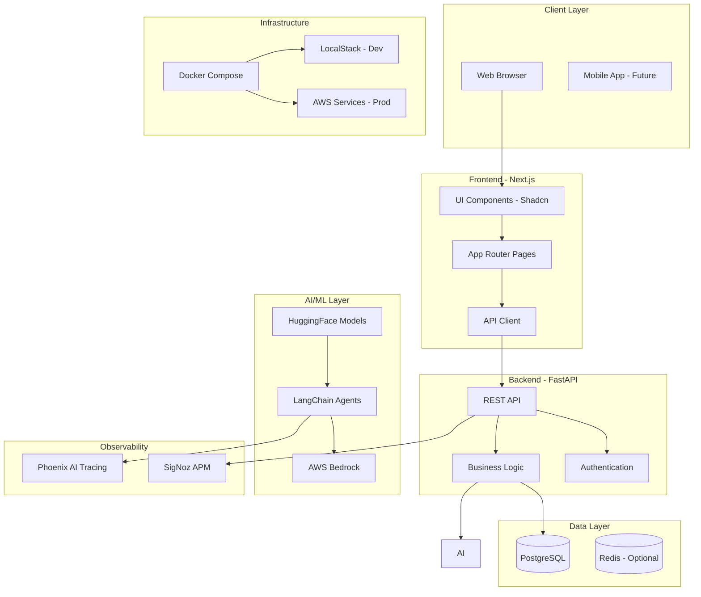

# Technical Requirements Template

This template is used by the Product Manager agent to generate technical requirements documents for new product initiatives.

## File Naming Convention

`.cursor/plans/project-init/[product-name]-technical-requirements.plan.md`

Example: `task-management-app-technical-requirements.plan.md`

## Template Structure

```markdown
---
name: [Product Name]
overview: [One-sentence product description]
target_users: [Primary user personas]
problem_statement: [Problem being solved]
uses_template_defaults: [true/false]
sprint_plan_file: .cursor/plans/project-init/[product-name]-sprint.plan.md
github_repo: [owner/repo]
mcp_integrations_enabled: [true/false]
specialist_agents:
  scientific_researcher:
    engaged: [true | false]
    mode: [mcp | collaboration | not_engaged]
    domain: "[Domain]"
    report_path: "[Path to report]"
  business_researcher:
    engaged: [true | false]
    mode: [mcp | collaboration | not_engaged]
    vertical: "[Vertical]"
    report_path: "[Path to report]"
  designer:
    system_diagrams: true
    ui_wireframes: [true | false]
    mode: [mcp | collaboration]
design_outputs:
  system_diagrams:
    - name: "High-Level Architecture"
      figma_url: "[Link]"
      export_path: "docs/diagrams/architecture.png"
    - name: "Component Diagram"
      figma_url: "[Link]"
      export_path: "docs/diagrams/components.png"
    - name: "Data Flow Diagram"
      figma_url: "[Link]"
      export_path: "docs/diagrams/data-flow.png"
  wireframes:
    created: [true | false]
    figma_url: "[Link]"
  design_specs:
    created: [true | false]
    document_path: "[Path]"
todos:
  - id: phase-1-foundation
    content: Phase 1 - Foundation Setup
    status: pending
  - id: phase-2-core
    content: Phase 2 - Core Features Development
    status: pending
  - id: phase-3-features
    content: Phase 3 - Additional Features and Polish
    status: pending
isProject: false
---

# [Product Name] - Technical Requirements

## User Story

As a [user role], I want [capability] so that [benefit].

## Problem Statement

[Detailed description of the problem this product solves. Include:
- Current pain points
- Why existing solutions are inadequate
- Impact of the problem on users]

## Target Users & Personas

### Persona 1: [Name/Role]
- **Background**: [Description]
- **Goals**: [What they want to achieve]
- **Pain Points**: [Current challenges]
- **Tech Savviness**: [Low/Medium/High]

### Persona 2: [Name/Role]
[Repeat structure]

## Research Findings

### Scientific Research
[If engaged - Summary of Claude MCP research or collaboration guidance]
- **Domain**: [AI/ML, Bioinformatics, etc.]
- **Key Findings**: [Research-backed insights]
- **Recommended Technologies**: [With rationale]
- **Technical Risks**: [Identified concerns]
- **References**: [Research sources or general guidance notes]
- **Report**: [Link to detailed research report]

### Business Research  
[If engaged - Summary of Claude MCP research or collaboration guidance]
- **Vertical**: [E-commerce, Healthcare, etc.]
- **Market Insights**: [Industry analysis]
- **Regulatory Requirements**: [Compliance needs]
- **Business Risks**: [Market concerns]
- **References**: [Industry sources or general guidance notes]
- **Report**: [Link to detailed research report]

## Core Features (MVP Scope)

### Feature 1: [Feature Name] - MUST HAVE
**Description**: [Detailed description]
**User Value**: [Why this matters to users]
**Technical Notes**: [Implementation considerations]
**Acceptance Criteria**:
- [ ] Criterion 1
- [ ] Criterion 2

### Feature 2: [Feature Name] - MUST HAVE
[Repeat structure]

### Feature 3: [Feature Name] - NICE TO HAVE
[Repeat structure]

## Technology Stack

[If uses_template_defaults = true:]

This product uses the cursor-fullstack-template opinionated technology stack as defined in README.md:

- **Languages**: Python (backend) + TypeScript (frontend)
- **Frontend**: Next.js + Shadcn UI
- **Backend**: FastAPI
- **Database**: PostgreSQL [or Cassandra for time-series/high-volume data]
- **AI/ML**: HuggingFace + LangChain
- **Infrastructure**: Docker + Make
- **Cloud Provider**: AWS
- **Local Development**: LocalStack for AWS emulation
- **Observability**: SigNoz + Phoenix

[If uses_template_defaults = false:]

This product uses a customized technology stack:

### Frontend
- Framework: [Framework name]
- UI Library: [Library name]
- State Management: [Tool name]

### Backend
- Framework: [Framework name]
- API Style: [REST/GraphQL/gRPC]
- Runtime: [Runtime environment]

### Database
- Primary Database: [Database name]
- Purpose: [Why chosen]
- Backup Strategy: [Approach]

### Infrastructure
- Containerization: [Docker/Other]
- Build Tool: [Make/npm/other]
- CI/CD: [GitHub Actions/other]

## Cloud Services (AWS)

[Always include LocalStack for local development]

### Compute
- [ ] EC2 - [Purpose: e.g., model training]
- [ ] ECS - [Purpose: e.g., container orchestration]
- [ ] Lambda - [Purpose: e.g., serverless functions]

### Storage
- [ ] S3 - [Purpose: e.g., file storage]
- [ ] RDS - [Purpose: e.g., managed PostgreSQL]

### AI/ML
- [ ] Bedrock - [Purpose: e.g., LLM hosting]
- [ ] SageMaker - [Purpose: e.g., model training/inference]

### Monitoring
- [ ] CloudWatch - Integration with SigNoz

### Local Development
- [x] LocalStack - AWS service emulation for local development

## Monitoring & Observability

### SigNoz
- Application performance monitoring
- Distributed tracing
- Log aggregation
- Custom dashboards

### Phoenix (AI/ML specific)
- LLM call tracing
- Token usage tracking
- Model performance metrics
- Prompt engineering insights

## External Integrations

### Authentication
- **Provider**: [Auth0/Clerk/Cognito/Custom]
- **Strategy**: [OAuth/JWT/Session]
- **MFA**: [Enabled/Disabled]

### Payment Processing
- **Provider**: [Stripe/PayPal/None]
- **Supported Methods**: [Credit card/ACH/etc.]

### Email
- **Provider**: [SendGrid/AWS SES/None]
- **Use Cases**: [Transactional/Marketing]

### Other Services
- [Service name]: [Purpose]

## MCP Work Tracking Integration

[If mcp_integrations_enabled = true:]

This product uses MCP (Model Context Protocol) integrations for work tracking:

### Notion
- Sprint planning documentation
- Knowledge base for product
- Meeting notes and decisions
- Retrospective tracking

### Linear
- Issue tracking and workflow management
- Sprint tickets and status
- Dependency tracking
- Project roadmap

### Discord
- Team communication and notifications
- Sprint announcements
- Blocker escalation
- Daily standup coordination

**Sync Flow**: Linear (source) → Notion (documentation) → Discord (notifications)

[If mcp_integrations_enabled = false:]
Manual work tracking using GitHub Issues only.

## System Architecture Diagrams

### High-Level Architecture

[Figma Link or Mermaid code]

**Description**: [Brief description of the high-level architecture showing main system components and their relationships]

### Component Diagram

[Figma Link or Mermaid code]

**Description**: [Brief description of detailed component view showing services and modules]

### Data Flow Diagram

[Figma Link or Mermaid code]

**Description**: [Brief description of how data flows through the system]

[If deployment architecture diagram created]:
### Deployment Architecture

[Figma Link or Mermaid code]

**Description**: [Brief description of infrastructure and cloud resources]

## UI Design (If Applicable)

[If ui_wireframes created]:

### Wireframes

#### Flow 1: [Flow Name]

[Figma Link or text description]

**Screens**:
- Screen 1: [Name and description]
- Screen 2: [Name and description]

**Key Interactions**:
- [Interaction 1 description]
- [Interaction 2 description]

#### Flow 2: [Flow Name]
[Repeat structure]

### Design Specifications

[If design_specs created - MCP mode only]:

**Color Palette**:
- Primary: #[hex]
- Secondary: #[hex]
- Accent: #[hex]
- Background: #[hex]
- Text: #[hex]

**Typography**:
- Heading 1: [Font family, size, weight]
- Heading 2: [Font family, size, weight]
- Body: [Font family, size, weight]

**Spacing System**:
- Base unit: [px]
- Scale: [spacing values]

**Component Standards**:
- Buttons: [Specifications]
- Forms: [Specifications]
- Cards: [Specifications]

[If using Shadcn UI defaults, note alignment with standard components]

## Architecture Overview



## Scale & Performance Requirements

### Expected Scale
- **Launch**: [< 100 / 100-1K / 1K-100K / 100K+ users]
- **6 Months**: [Projected growth]
- **1 Year**: [Projected growth]

### Performance Targets
- **API Response Time**: [< 1s / < 500ms / < 100ms]
- **Page Load Time**: [< 3s / < 2s / < 1s]
- **Database Query Time**: [< 100ms typical]
- **Availability**: [99.9% / 99.99%]

### Scalability Strategy
- **Horizontal Scaling**: [Approach for backend]
- **Database Scaling**: [Read replicas/sharding strategy]
- **Caching**: [Redis/CDN strategy]
- **Load Balancing**: [AWS ALB/other]

## UI/UX Guidelines

### Design Style
- [Minimalist / Feature-rich dashboard / Mobile-first / Standard]

### Component Library
- Shadcn UI with custom theming
- Consistent spacing and typography
- Responsive breakpoints: mobile (< 640px), tablet (< 1024px), desktop (>= 1024px)

### Accessibility
- **Target Compliance**: [WCAG 2.1 AA / AAA / Basic]
- **Keyboard Navigation**: Required
- **Screen Reader Support**: Required
- **Color Contrast**: Minimum 4.5:1

### Dark Mode
- [Enabled by default with Shadcn UI / Not required]
- User preference saved in local storage

### Key User Flows
1. **[Flow Name]**: [Step-by-step user journey]
2. **[Flow Name]**: [Step-by-step user journey]

## Constraints

### Technical Constraints
- [Constraint 1: e.g., Must work offline]
- [Constraint 2: e.g., Max file size 10MB]

### Time Constraints
- **MVP Target**: [Date or timeframe]
- **Key Milestones**: [List of dates]

### Resource Constraints
- **Team Size**: [Number and roles]
- **Budget**: [If applicable]

### Compliance & Legal
- **Data Privacy**: [GDPR/CCPA requirements]
- **Security**: [Specific requirements]
- **Industry Standards**: [If applicable]

## Definition of Done (MVP)

The MVP is considered complete when:

- [ ] All MUST HAVE features are implemented and tested
- [ ] Core user flows are functional end-to-end
- [ ] Authentication and authorization working
- [ ] Database schema deployed and migrations working
- [ ] API endpoints documented (OpenAPI/Swagger)
- [ ] Frontend responsive on mobile, tablet, desktop
- [ ] Unit test coverage > 70%
- [ ] Integration tests for critical paths
- [ ] Security audit completed (basic)
- [ ] Performance benchmarks met
- [ ] Observability dashboards configured
- [ ] Documentation complete (README, API docs, deployment guide)
- [ ] Production deployment successful
- [ ] Monitoring and alerting configured

## Success Metrics

### User Metrics
- **Adoption**: [Target number of users by date]
- **Engagement**: [DAU/MAU target]
- **Retention**: [Week 1, Month 1 retention targets]

### Technical Metrics
- **Uptime**: [Target percentage]
- **Error Rate**: [< X% target]
- **Response Time**: [P50, P95, P99 targets]

### Business Metrics
- **[Custom Metric 1]**: [Target]
- **[Custom Metric 2]**: [Target]

## Risk Assessment

### High Priority Risks
1. **[Risk Description]**
   - Impact: [High/Medium/Low]
   - Likelihood: [High/Medium/Low]
   - Mitigation: [Strategy]

### Medium Priority Risks
[Repeat structure]

### Dependencies
- External service: [Service name] - [Mitigation if unavailable]
- Third-party API: [API name] - [Mitigation plan]

## Next Steps

After validation by Chief Architect:

1. Scrum Master creates sprint plan
2. Tickets generated using create-github-issue.sh
3. Team assignments by Chief Architect
4. Sprint kickoff
5. [If MCP enabled] Sync to Notion/Linear/Discord

## References

- Template README: [README.md](../../README.md)
- Opinionated Choices: See README.md
- Agent Files: [.cursor/agents/](.cursor/agents/)
- Example Sprint Plan: [sprint-plan-example.plan.md](../sprint-plan-example.plan.md)
```

## Variable Sections

The following sections vary based on user responses:

### uses_template_defaults = true
- Show concise tech stack referencing README.md
- Emphasize standard patterns
- Include all opinionated tools

### uses_template_defaults = false
- Show detailed customized tech stack
- Document reasons for deviations
- Note compatibility concerns

### mcp_integrations_enabled = true
- Include full MCP integration section
- Document sync workflows
- List agent responsibilities

### mcp_integrations_enabled = false
- Simple statement: "Manual tracking via GitHub Issues"
- No MCP agent coordination

### Scale = prototype
- Emphasize LocalStack
- Minimal AWS services
- SigNoz for observability

### Scale = large
- Full AWS service suite
- Advanced monitoring
- Scalability architecture details

## Mermaid Diagram Customization

Adjust architecture diagram based on:
- Database choice (PostgreSQL/Cassandra/MongoDB)
- AI/ML integration (with/without Bedrock)
- Authentication provider
- Caching layer (if needed)
- Mobile app (if future consideration)

## Validation Checklist

Before finalizing technical requirements:

- [ ] All user responses incorporated
- [ ] Tech stack clearly documented
- [ ] AWS services justified
- [ ] Architecture diagram matches tech choices
- [ ] Scale requirements realistic
- [ ] Success metrics measurable
- [ ] Definition of Done specific and achievable
- [ ] Risks identified and mitigated
- [ ] GitHub repo configured in frontmatter
- [ ] Sprint plan file reference correct
