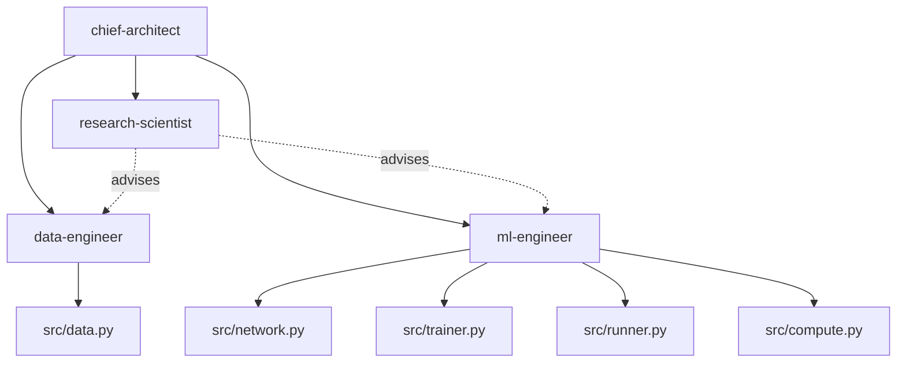

# Deep Learning with Cursor

[](https://github.com/jxtngx)
[](https://opensource.org/licenses/Apache-2.0)

A modular, multi-agent based system for PyTorch, Hugging Face, and AWS, powered by Cursor's AI-assisted development.

> **Note**: This project uses specialized agent definitions in `.cursor/agents/` coordinated by the Chief Architect.

## Philosophy

This repository embodies an **agent-based architecture** for machine learning projects, where specialized AI agents collaborate to deliver comprehensive solutions. Each agent maintains deep expertise in their domain while remaining modality and task agnostic.

## Core Principles

<table>
<tr>
<td style="background-color: black; color: #808080; padding: 15px; width: 50%; vertical-align: top;"><h3 style="margin-top: 0; margin-bottom: 10px; color: white;">Separation of Concerns</h3>Each agent owns a specific technical domain, preventing overlap and ensuring expertise depth.</td>
<td style="background-color: black; color: #808080; padding: 15px; width: 50%; vertical-align: top;"><h3 style="margin-top: 0; margin-bottom: 10px; color: white;">Modality Agnostic</h3>Agents adapt to any ML task—vision, NLP, audio, multimodal—without hardcoded assumptions.</td>
</tr>
<tr>
<td style="background-color: black; color: #808080; padding: 15px; width: 50%; vertical-align: top;"><h3 style="margin-top: 0; margin-bottom: 10px; color: white;">Performance First</h3>Optimized for PyTorch 2.3+ with distributed training and NVIDIA GPU acceleration.</td>
<td style="background-color: black; color: #808080; padding: 15px; width: 50%; vertical-align: top;"><h3 style="margin-top: 0; margin-bottom: 10px; color: white;">Cloud Native</h3>Built for AWS EC2 environments with scalable infrastructure patterns.</td>
</tr>
<tr>
<td colspan="2" align="center" style="background-color: black; color: #808080; padding: 15px;"><h3 style="margin-top: 0; margin-bottom: 10px; color: white;">Collaborative Intelligence</h3>Agents work in concert, sharing context and building on each other's outputs.</td>
</tr>
</table>

## Skill Progression Platform

This template serves as a gateway to two critical ML engineering competencies:

### PyTorch Mastery
Progress from basic tensor operations to production-ready ML systems through practical, agent-guided development. The `prompting-guide/` provides a structured path from prompt dependency to independent PyTorch expertise.

### Agentic Application Development
The multi-agent architecture here provides hands-on experience with patterns directly applicable to:
- **LangChain**: Chain-of-thought reasoning, tool use, and agent orchestration
- **AWS Bedrock Agents**: Structured prompts, knowledge bases, and action groups
- **NVIDIA NeMo Guardrails**: Agent safety, structured outputs, and conversation flows

By working with this template's agent team, you're learning:
- Agent coordination patterns (supervisor/worker models)
- Tool use and function calling (ReAct patterns)
- Multi-agent orchestration (parallel and sequential workflows)

These skills transfer directly to building production agent applications, making this template both a PyTorch learning tool and an introduction to the agentic AI ecosystem.

## Getting Started

1. **Define Your Project**: Consult the Chief Architect to engage the appropriate agents
2. **Select Your Team**: The agent router directs to appropriate specialist agents
3. **Iterate and Build**: Agents collaborate to implement your solution

## Architecture

### Agent Team Structure



### Workflow

```
Agents → Specialized Expertise → Collaborative Implementation → Deployed Solution
```

Each agent operates as an expert consultant, providing:
- Domain-specific knowledge
- Best practice implementations
- Performance optimizations
- Quality assurance

## Key Technologies

- **PyTorch 2.3+**: Core deep learning framework
- **Hugging Face**: Model and dataset ecosystem
- **AWS**: Cloud infrastructure and services
- **Cursor**: AI-powered development assistance

## Repository Structure

- `.cursor/agents/`: Specialized agent definitions
- `docs/`: Documentation and agile artifacts
  - `adr/`: Architecture Decision Records
  - `sprints/`: Sprint planning and tracking
- `prompt-templates/`: Task-specific prompt examples
- `prompting-guide/`: Comprehensive guide on prompting techniques and MLE learning path
- `src/`: Core Python modules (non-package structure)
  - `data.py`: Data pipeline components
  - `network.py`: Model architectures
  - `trainer.py`: Training orchestration
  - `server.py`: API and serving
  - `runner.py`: CLI entry point

## Quick Start

### Setup with uv

```bash
# Install uv (if not already installed)
curl -LsSf https://astral.sh/uv/install.sh | sh

# Install dependencies
uv pip install -r requirements.txt

# Install dev dependencies
uv pip install -e ".[dev]"

# Setup pre-commit hooks
pre-commit install
```

## Using Cursor Agents

> View all available agents and their capabilities in [.cursor/agents/chief-architect.md](.cursor/agents/chief-architect.md)

### Basic Agent Invocation

In Cursor, you can directly invoke specialized agents using `@agent-[NAME]` or let the agent router automatically direct your request to the appropriate expert.

#### Direct Agent Routing
```bash
# Explicitly call a specific agent using @agent-[NAME]
$ "@agent-ml-engineer implement a custom attention mechanism for video understanding"
```

#### Automatic Routing
```bash
# Describe your task and the router directs to appropriate agents
$ "I need to fine-tune a BERT model on my custom dataset with limited GPU memory"

# The agent system engages the ML/DL team
chief-architect: Route method choice to research-scientist, data to data-engineer, training to ml-engineer
research-scientist: Recommend baseline, loss, and memory-aware metrics
data-engineer: Configure the DataLoader contract
ml-engineer: Implement fine-tuning tests, then the training loop
```

### Common Workflows

#### Starting a New Project
```bash
$ "I want to build an image classification system for medical X-rays"

chief-architect: Route research, data, and training
research-scientist: Formulate the task, baseline, and metrics
data-engineer: Select a dataset and loader contract
ml-engineer: Write tests, then the model and trainer
```

#### Fine-tuning with Limited Resources
```bash
$ "Fine-tune Llama-2-7B on my customer support dataset using QLoRA"

research-scientist: Recommend QLoRA baseline and eval thresholds
data-engineer: Set up the DataLoader
ml-engineer: Implement QLoRA training and metrics
```

#### Creating Test-Driven ML Code
```bash
$ "Write tests for a vision transformer training pipeline"

ml-engineer: Write failing tests, then implement the ViT and trainer
```

### Multi-Agent Collaboration Example

```bash
$ "Train a real-time object detector with <50ms GPU latency"

chief-architect: Approve topology and latency budget
research-scientist: Recommend detector family and metrics
data-engineer: Build detection loaders and transforms
ml-engineer: Implement model, training, and latency tests
```

### Tips for Effective Agent Use

1. **Be Specific**: Include constraints, metrics, and requirements
2. **Direct Invocation**: Use `@agent-[NAME]` to call specific agents
3. **Use Templates**: Copy prompts from `prompt-templates/` for consistency
4. **Test First**: data-engineer and ml-engineer write tests before implementation
5. **Trust Routing**: chief-architect routes when the owner is unclear

### Agent Coordination Patterns

```bash
# Iterative workflow
$ "Test → Data → Model → Training → Deploy (continuous iteration)"

# Specific expertise request
$ "@agent-research-scientist design custom metrics for video quality assessment"
```

## Design Principles

### Non-Package Architecture
The `src/` directory contains standalone modules that can be run directly without package installation. This simplifies deployment and reduces complexity while maintaining clear separation of concerns.

### Agile Development Process
- **Architecture Decision Records**: Documented technical decisions in `docs/adr/`
- **Sprint Tracking**: Comprehensive sprint planning and retrospectives in `docs/sprints/`
- **Test-Driven Development**: Implementers write tests before changing their modules
- **Continuous Integration**: Built into agent collaboration workflows

### Modern Tooling
- **uv**: Fast, reliable Python package management
- **Ruff**: Single tool for linting and formatting
- **Pre-commit**: Automated code quality checks
- **Type hints**: Full typing support throughout

This template provides the foundation for any ML project, from research prototypes to production systems.

## Citation

If you use this project in your research or work, please cite:

```bibtex
@software{deep_learning_with_cursor,
  author = {jxtngx},
  title = {Deep Learning with Cursor: Multi-Agent ML Development Framework},
  year = {2025},
  url = {https://github.com/jxtngx/deep-learning-with-cursor},
  license = {Apache-2.0}
}
```

## License

Copyright 2025 jxtngx

Licensed under the Apache License, Version 2.0. See [LICENSE](LICENSE) for details.
