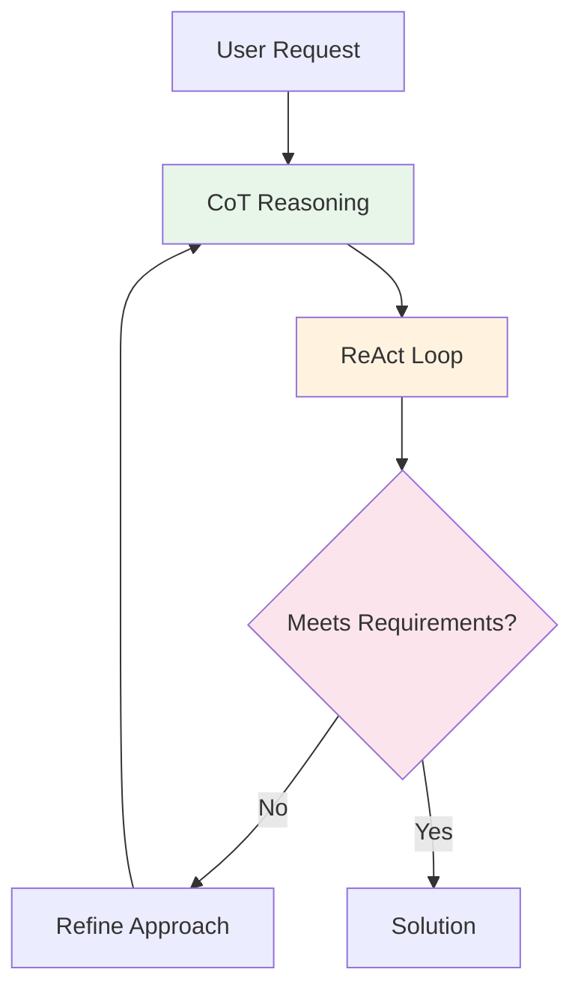
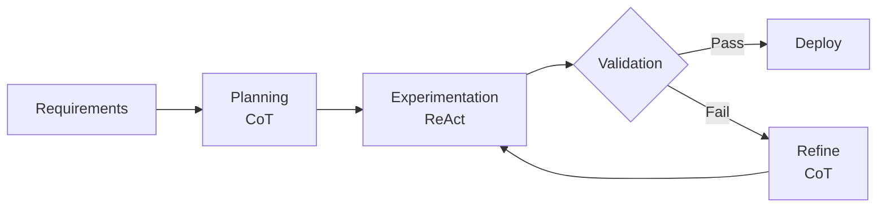

# Hybrid Prompting Techniques

## Overview

The real power emerges when we combine Chain of Thought reasoning with ReAct's action capabilities. This creates a comprehensive framework for solving complex ML problems.

## The Complete Stack



## Human Analogy

Think of this as a complete problem-solving session with a skilled team:
1. **Requirements Analyst**: Defines clear requirements
2. **Technical Lead** (CoT): Plans the approach step-by-step
3. **Engineers** (ReAct): Execute, test, and iterate
4. **Quality Assurance**: Ensures standards are met

## Hybrid Pattern Examples

### Pattern 1: Full Stack Implementation

```markdown
## Task
As a researcher, implement a state-of-the-art NLP model
to process customer feedback efficiently.

## Chain of Thought Planning
Let me break this down:
1. Analyze the task requirements
2. Select appropriate architecture
3. Prepare data pipeline
4. Implement training loop
5. Optimize and validate

## ReAct Execution

**Thought**: First, understand the data characteristics
**Action**: Analyze customer feedback dataset
**Observation**: 50k samples, average length 128 tokens, 5 sentiment classes

**Thought**: Based on data size and task, BERT-base should work well
**Action**: Load pretrained BERT from HuggingFace
**Observation**: Model loaded, 110M parameters

**CoT Reasoning**: Given 50k samples, I should:
- Use 80/10/10 train/val/test split
- Fine-tune for 3-5 epochs
- Use learning rate 2e-5 (standard for BERT)

**Action**: Implement training pipeline
**Observation**: Training loss decreasing, validation stable

## Validation
- Constraint: Fits in 8GB GPU memory
- Target: 92% accuracy achieved
- No overfitting detected
- Production-ready model delivered
```

### Pattern 2: Iterative Optimization

```markdown
## Initial Request
Build the fastest possible inference pipeline for ResNet50

## Hybrid Approach

### Round 1: Baseline
**CoT**: Start with standard PyTorch implementation
**Action**: Benchmark baseline model
**Observation**: 45ms per image
**Check**: Not meeting <20ms target

### Round 2: Optimization
**CoT**: Try TorchScript compilation
**Action**: Convert model to TorchScript
**Observation**: 32ms per image
**Check**: Better but still not meeting target

### Round 3: Advanced Optimization
**CoT**: Combine multiple techniques:
- ONNX conversion
- INT8 quantization
- Batch processing

**Actions**:
1. Convert to ONNX
2. Apply quantization
3. Implement batching

**Observations**:
- ONNX: 25ms
- Quantized: 18ms
- Batched: 12ms amortized

**Check**: Meeting all criteria
```

## Advanced Hybrid Patterns

### Self-Consistency

```markdown
## Task: Robust Model Selection

**Approach**: Generate multiple solutions and validate

### Solution 1 (CoT + ReAct)
**Reasoning**: ViT good for fine-grained classification
**Action**: Test ViT-B/16
**Result**: 94% accuracy, 30ms inference

### Solution 2 (CoT + ReAct)
**Reasoning**: EfficientNet optimized for edge
**Action**: Test EfficientNet-B4
**Result**: 93% accuracy, 15ms inference

### Solution 3 (CoT + ReAct)
**Reasoning**: ConvNeXt modernized CNN
**Action**: Test ConvNeXt-Tiny
**Result**: 95% accuracy, 20ms inference

### Evaluation
Constraints: <25ms inference (Solutions 2,3)
Targets: >93% accuracy (All solutions)
Best choice: ConvNeXt-Tiny (best accuracy within constraints)
```

### Tree of Thoughts with Actions

```markdown
## Task: Debug Convergence Issue

**Branch 1: Learning Rate**
├── Thought: LR might be too high
├── Action: Test LR range
├── Observation: Lower LR helps
└── Continue this path

**Branch 2: Architecture**
├── Thought: Model might be too complex
├── Action: Try smaller model
├── Observation: Still not converging
└── Abandon this path

**Branch 3: Data Quality**
├── Thought: Data might have issues
├── Action: Validate dataset
├── Observation: Found label noise
└── Priority path

**Resolution via Branch 3**:
- Action: Clean noisy labels
- Result: Model converges properly
```

## Prompt Chaining with Hybrid Techniques

### Multi-Stage Pipeline

```markdown
## Stage 1: Data Preparation
**Task**: Prepare ImageNet subset
**CoT**: Need balanced classes, proper splits
**ReAct**: Download, filter, split data
**Output**: Ready dataset

## Stage 2: Architecture Design
**Input**: Dataset specs from Stage 1
**Task**: Design efficient architecture
**CoT**: Analyze compute/accuracy tradeoffs
**ReAct**: Prototype and benchmark options
**Output**: Optimized model architecture

## Stage 3: Training Pipeline
**Input**: Data + Architecture
**Task**: Implement distributed training
**CoT**: Plan scaling strategy
**ReAct**: Setup multi-GPU training
**Output**: Trained model

## Stage 4: Deployment
**Input**: Trained model
**Task**: Create inference service
**CoT**: Design API and optimization
**ReAct**: Deploy and monitor
**Output**: Production service
```

## Meta-Prompting for ML Tasks

### Framework Selection

```markdown
## Meta-Prompt
"Given these requirements, which framework combination should I use?"

Requirements:
- Real-time inference needed
- Limited labeled data
- High accuracy required

## Hybrid Analysis

**CoT Reasoning**:
- Real-time -> Need optimization focus
- Limited data -> Transfer learning essential
- High accuracy -> Strong architecture needed

**ReAct Investigation**:
- Action: Survey available pretrained models
- Action: Benchmark inference speeds
- Action: Test few-shot performance

**Requirements Check**:
- Constraint: <50ms latency
- Target: >95% accuracy
- Risk: Overfitting on small data

**Recommendation**:
Use CoT+ReAct pattern with:
- Pretrained transformer
- Few-shot learning
- ONNX optimization
```

## Practical Workflow

### Complete Development Cycle



### Daily Development Pattern

```markdown
Morning Planning (CoT):
- Review task requirements
- Think through approach
- Identify potential issues

Development (ReAct):
- Implement solutions
- Test hypotheses
- Gather metrics

Evening Review:
- Check against requirements
- Measure targets achieved
- Document risks avoided
```

## Benefits of Hybrid Approach

1. **Comprehensive Coverage**: No aspect overlooked
2. **Fail-Safe Mechanisms**: Multiple validation points
3. **Optimal Solutions**: Reasoning + experimentation
4. **Clear Documentation**: Every decision traced
5. **Reproducible Process**: Can be repeated reliably

## Human Parallel

Like a well-functioning R&D team:
- Clear project goals (Requirements)
- Technical planning sessions (CoT)
- Hands-on experimentation (ReAct)
- Quality gates (Validation)
- Iterative refinement (Hybrid loops)

## Key Success Factors

1. **Start with clear requirements**
2. **Think before acting** (CoT before ReAct)
3. **Validate continuously**
4. **Iterate based on evidence** (ReAct observations)
5. **Document the journey** (All techniques together)

## Next Steps

Now let's explore the [path to prompt-free PyTorch development](05-pytorch-automation.md) ->
