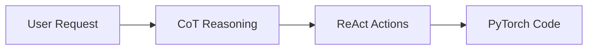

# Prompting Guide for PyTorch ML Development

This guide explains how to use established prompting techniques to create effective machine learning solutions using PyTorch and specialized agents.

## Overview

This repository uses:
- **Chain of Thought (CoT)**: Step-by-step reasoning for complex ML decisions
- **ReAct**: Combining reasoning with tool actions for iterative development
- **Hybrid Techniques**: Combining CoT and ReAct for sophisticated workflows

Think of this as teaching a team of specialists how to work together, where each conversation follows a structured pattern that leads to working code.

## Guide Structure

1. **[Chain of Thought Prompting](02-chain-of-thought.md)** - Step-by-step reasoning in ML tasks
2. **[ReAct Framework](03-react-framework.md)** - Combining reasoning with tool actions
3. **[Hybrid Prompting Techniques](04-hybrid-techniques.md)** - Combining multiple approaches
4. **[PyTorch Automation Path](05-pytorch-automation.md)** - Moving toward prompt-free development
5. **[MLE Learning Path](06-mle-learning-path.md)** - Building expertise alongside AI agents

## Quick Start

### Basic Pattern
```
Task Description -> Reasoning Steps (CoT) -> Actions (ReAct) -> PyTorch Code
```

### Human Analogy
Imagine briefing a development team:
- **Chain of Thought**: "Let me think through this step by step"
- **ReAct**: "I'll research, then implement, then verify"

## Core Concepts at a Glance



## When to Use Each Technique

| Situation | Technique | Example |
|-----------|-----------|---------|
| Complex logic needed | Chain of Thought | Designing neural architecture |
| External data required | ReAct | Fetching datasets, checking documentation |
| Multi-step workflows | Hybrid (CoT + ReAct) | Full training pipeline |

## Progressive Complexity

### Level 1: Chain of Thought
Include reasoning steps for complex problems.

### Level 2: ReAct
Add tool usage and external knowledge retrieval.

### Level 3: Hybrid Approach
Combine CoT and ReAct for sophisticated workflows.

### Level 4: Automation
Build patterns that eliminate repetitive prompting.

## Examples Directory

- [Basic CoT Example](examples/basic-cot.md) - Simple reasoning chain
- [ReAct Workflow](examples/react-workflow.md) - Tool usage pattern
- [Full Pipeline](examples/full-pipeline.md) - Complete ML task

## Key Principles

1. **Reason Explicitly**: Show your thinking process (CoT)
2. **Act Deliberately**: Use tools when needed (ReAct)
3. **Iterate**: Validate results and refine approach
4. **Automate**: Build patterns that reduce repetitive prompting

## Goal: Prompt-Free PyTorch

The ultimate aim is to build patterns and agents sophisticated enough that you can simply describe what you want in natural language, and the system generates production-ready PyTorch code without detailed prompting.

## Navigation

Start with [Chain of Thought Prompting](02-chain-of-thought.md) ->
